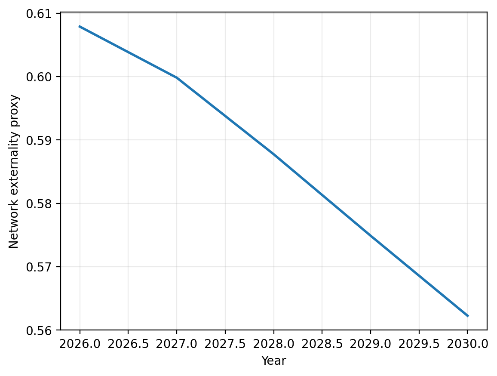
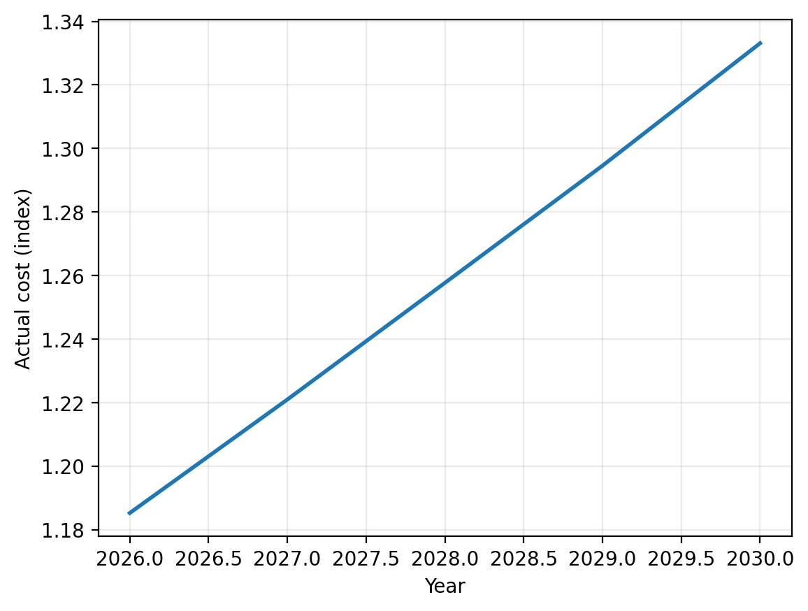
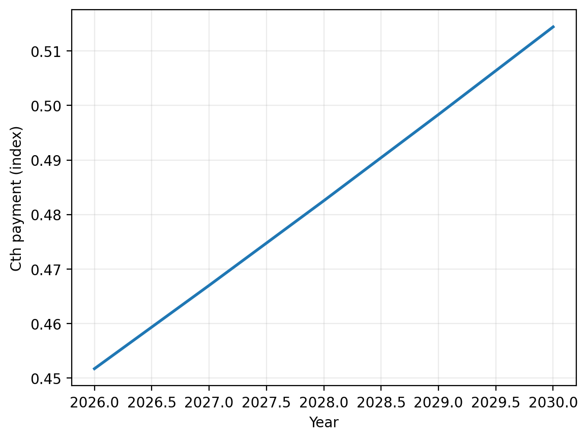
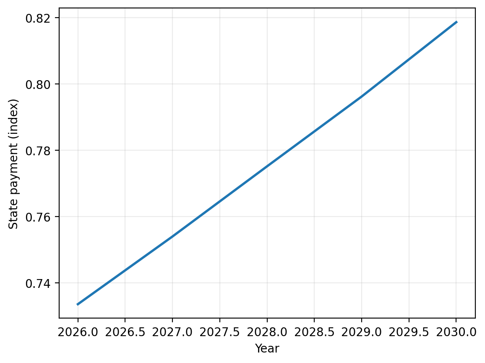

# NHRA game-theory simulation — v13

**Build date:** 2025-12-20

> Interpretation: stylised mechanism model. NEP is treated as an index by default and used for illustrative cost-stack plots.

## Baseline dynamics
### Network externality proxy (pressure × exit-block share)

### Actual cost index (representative NWAU)

### Commonwealth payment index (representative NWAU)

### State residual payment index (representative NWAU)

## Scenario comparison (end-year)
| scenario   | interventions                                                      |   end_year |   pressure_mean |   offload_mean |   within4_mean |   rr_mean |   cth_nominal_mean |   cth_effective_mean |   effgap_mean |   discharge_mean |
|:-----------|:-------------------------------------------------------------------|-----------:|----------------:|---------------:|---------------:|----------:|-------------------:|---------------------:|--------------:|-----------------:|
| baseline   | nan                                                                |       2030 |         1.13297 |        17.7777 |       0.504352 |   1.04957 |           0.443768 |             0.386124 |     0.149505  |         0.878103 |
| pooled     | pooled                                                             |       2030 |         1.13082 |        17.7743 |       0.505404 |   1.04877 |           0.443768 |             0.386124 |     0.149505  |         0.874965 |
| discharge  | discharge                                                          |       2030 |         1.08611 |        17.6149 |       0.527993 |   1.0321  |           0.443628 |             0.385641 |     0.150584  |         0.821423 |
| indexation | indexation                                                         |       2030 |         1.12493 |        17.7182 |       0.508337 |   1.0465  |           0.435931 |             0.39413  |     0.106176  |         0.879679 |
| bundle     | pooled,discharge,indexation,integration,workforce,cap,audit_relief |       2030 |         1.04673 |        14.5649 |       0.5492   |   1.01711 |           0.433008 |             0.396493 |     0.0921877 |         0.82684  |