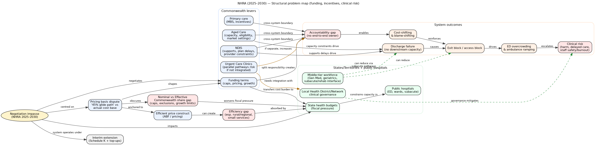
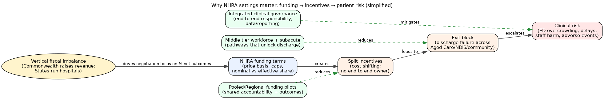
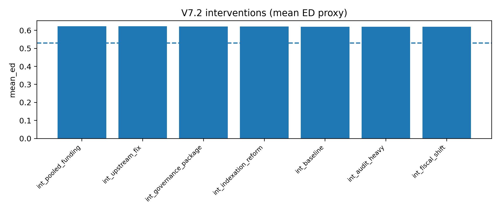
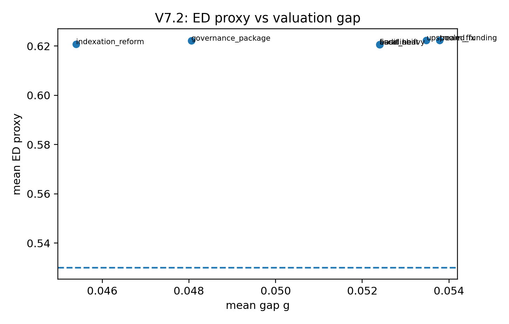
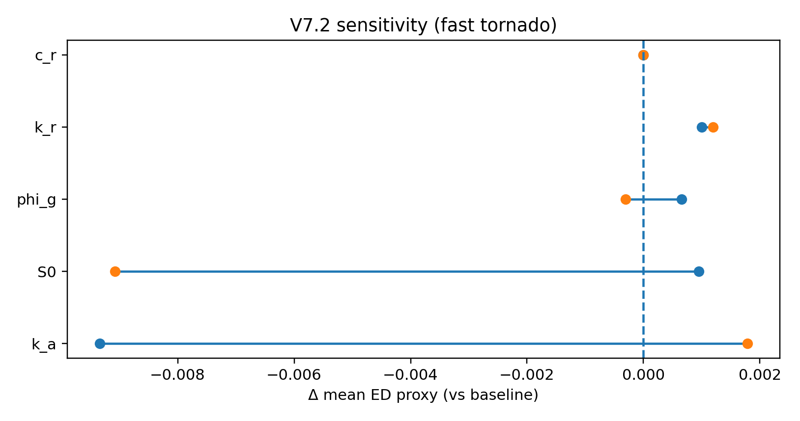
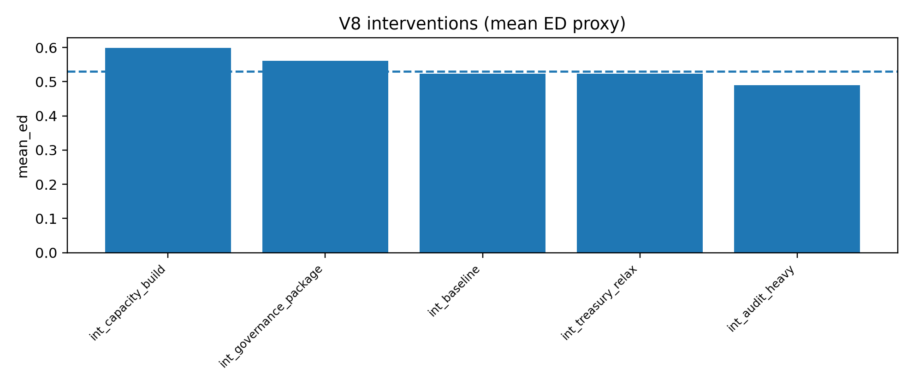
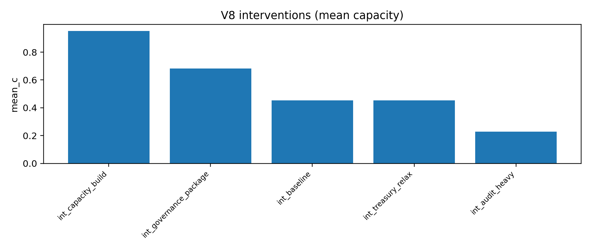
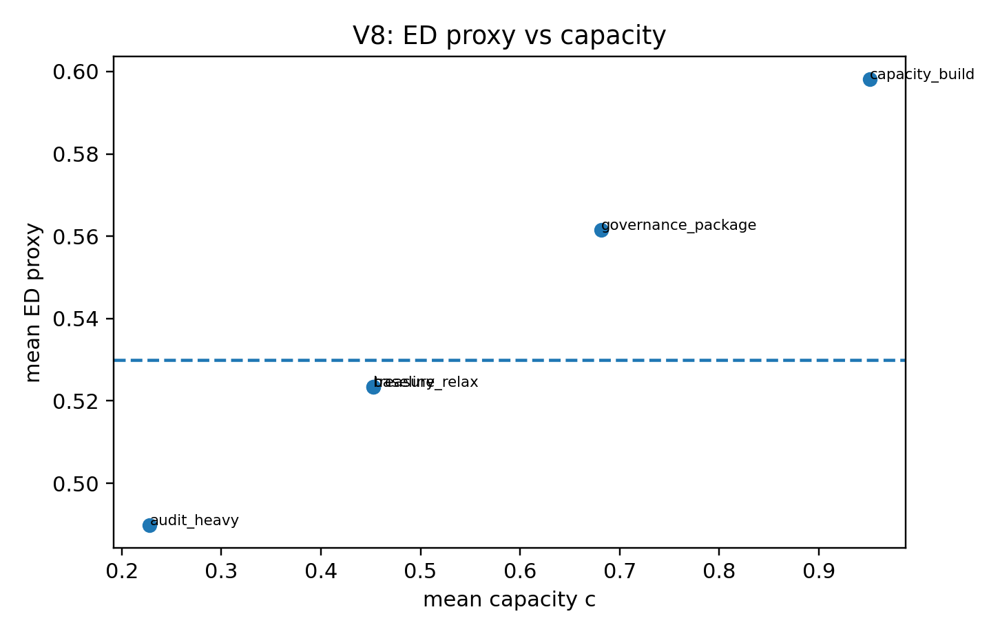

# NHRA negotiations: stylised game-theoretic mechanism modelling (Repo v2 — 20251220)

## What this is

This repository contains a **set of stylised game-theoretic “mechanism models”** intended to clarify *how* incentives,
constraints, and governance arrangements in the NHRA setting can generate:

- persistent **capacity pressure** in state hospital systems,
- a divergence between **nominal vs effective funding shares**, and
- “exit block” feedback loops that increase operational risk.

**Important:** these models are **conceptual**. They are *not* forecasts, and they do not claim identifiability of
real-world parameters. Their value is in stress-testing **mechanisms** and comparing **directional effects** of policy
packages.

---

## 1) Simulated expert reviews

### 1.1 Professor of Medicine (clinical safety lens)

**Major strengths**

- Clear linkage between governance/funding fractures and clinical risk (exit block, ED access block).
- Uses simple visuals to communicate system constraints.

**Major concerns**

- Needs a clearer **patient-safety causal chain**: which adverse outcomes are implied (mortality, harm, LOS), and which are
only proxies (ED≤4h).
- Requires **clinical validity framing**: why ED≤4h is used; when it fails; what other indicators should be triangulated.
- Explicitly separate **primary prevention** (upstream capacity) vs **operational mitigation** (hospital throughput).

**Requested changes**

- Add an explicit “Clinical implications” subsection for each model: mechanism → operational effect → safety implication.
- Add sensitivity showing that conclusions do not depend on ED≤4h alone.

---

### 1.2 Professor of Health Policy (institutions & incentives lens)

**Major strengths**

- Strong framing around Vertical Fiscal Imbalance (VFI) and split accountability.
- Policy levers mapped to model parameters, enabling “what if” discussion.

**Major concerns**

- Needs sharper distinction between:
  - *constitutional/fiscal structure* (what cannot change quickly), and
  - *negotiation design* (what can be changed inside NHRA).
- Add a clearer “theory of change”: how pooled funding pilots or UCC integration changes incentives.

**Requested changes**

- Add a concise clause/levers table mapping NHRA mechanisms to incentives.
- Provide clear **policy-relevant scenarios** (bundled packages), not only single-parameter tweaks.

---

### 1.3 Professor of Health Management (operations & governance lens)

**Major strengths**

- Excellent for explaining why “funding alone” may not unlock throughput.
- Incorporates governance friction as a real-world constraint.

**Major concerns**

- The operational layer is simplified; requires clearer mapping to **governance artefacts**:
  - decision rights,
  - clinical governance lines,
  - data interoperability/handovers,
  - accountability for discharge delays.

**Requested changes**

- Add a “governance integration” intervention scenario explicitly: governance → reduced friction → improved throughput.
- Add a capacity state variable (so capacity erosion/build is represented).

*(Implemented via V8 capacity state, below.)*

---

### 1.4 Professor of Economics (strategic interaction lens)

**Major strengths**

- Explicit strategic interaction (cost shifting / bargaining / outside options).
- Hybrid models show how signalling and constraints affect agreement probability.

**Major concerns**

- Needs clearer **game form**: who moves when, what is observed, what is committed.
- If presented as “game theory,” distinguish Nash vs subgame perfect vs Markov perfect equilibrium.

**Requested changes**

- Provide a short methods appendix specifying equilibrium concepts per model.
- Provide an incremental modelling ladder (V1→V5→MPE V7.2→V8), clarifying what each addition buys.

---

### 1.5 Professor of Health Economics (incentives + measurement lens)

**Major strengths**

- The “efficiency gap” mechanism is central and well-communicated.
- Policy packages can be assessed via system-level metrics.

**Major concerns**

- Parameter “calibration” needs disciplined language and anchoring.
- Suggests adding a minimal “calibration table”: what each parameter represents and plausible range.

**Requested changes**

- Add a parameter dictionary + “anchoring assumptions” (what is fixed, why).
- Add tornado/sensitivity (already included for V7.2) and scenario comparisons.

---

### 1.6 MJA Journal Editor (clarity, scope, reporting lens)

**Major strengths**

- Timely, policy-relevant topic.
- Strong visuals.

**Major concerns**

- Must meet reporting expectations for modelling work:
  - transparent assumptions,
  - reproducible outputs,
  - limitations and scope.
- Requires a clear paper type: **Health Policy** / **Perspective** / **Analysis**.

**Requested changes**

- Provide a clear methods section and identify an appropriate reporting checklist.
- Provide a coherent “results” narrative: what the models show, without overclaiming.

---

### 1.7 Deputy Secretary (Commonwealth DoH) (feasibility & negotiation lens)

**Major strengths**

- Captures genuine constraints: capped funding, upstream capacity limits, discharge bottlenecks.
- Helps explain why State positions can be structurally rational.

**Major concerns**

- Avoid implying bad faith; keep language strictly institutional.
- Ensure recommendations are **implementable** within:
  - Cabinet/budget constraints,
  - audit/compliance obligations,
  - delivery risk.

**Requested changes**

- Present recommendations as *options with trade-offs*, not “demands”.
- Show how governance integration could be operationalised (e.g., UCC integration requirements).

---

## 2) Simulated panel discussion (what matters most)

**Consensus priorities**

1. **Transparency and reporting:** define assumptions, equilibrium concept, and limitations (Editor + Economics + Health Econ).
2. **Clinical meaning:** clarify what ED≤4h proxy is standing in for (Medicine + Management).
3. **Policy usability:** present bundled scenarios and trade-offs (Policy + Deputy Secretary).

**Tensions**

- Economists push for formal clarity; executives want interpretability.
- Clinicians want safety linkage; policy leads want institutional realism.

**Resolution**

- Use the hybrid model as a “mechanism sensitivity” scaffold, but keep the headline results at the level of
*directional effects of plausible policy packages*.

---

## 3) Action plan and what was implemented in Repo v2

### Implemented

- **Reproducible repo structure** (`scripts/`, `outputs/`, `reports/`) with deterministic seeds.
- **CI/CD setup** (`.github/workflows/ci.yml`) with lint (ruff) + smoke tests (pytest).
- Added **MPE extensions**:
  - **V7.2** (pressure x + valuation gap g) with intervention scenarios + tornado sensitivity.
  - **V8** (adds capacity c and Treasury constraint) to explicitly represent capacity erosion/build.

### Remaining (recommended next)

- Add an explicit **parameter table** for V1–V5 and for V7.2/V8 (definitions + plausible ranges).
- Add additional validation proxies (e.g., occupancy, LOS, ambulance offload time) if data are available.

---

## 4) Results overview (what the models show)

### 4.1 Governance diagrams (system mechanism map)

- Problem map: `outputs/NHRA_Problem_Map.png`
- Advocacy map: `outputs/NHRA_Advocacy_Map.png`





---

### 4.2 Mechanism scripts (V1–V5)

These generate plots into:

- `outputs/v1/` — foundational mechanism figures (externalities, pressure trajectories, stress tests)
- `outputs/v2/` — calibrated variants
- `outputs/v3/` — early hybrid dynamics
- `outputs/v4/` — hybrid with signalling + agreement probability
- `outputs/v5/` — hybrid with compliance burden

**Interpretation:** V1–V5 are best treated as *conceptual exhibits* supporting a policy argument about incentives and
feedback loops. They are not intended for parameter inference.

---

## 5) MPE suite findings (V7.2 + V8)

### 5.1 V7.2: interventions ranked by mean ED proxy

Toplines:

- Lower **upstream pressure injection** (S0) and lower **gap amplification** (phi_g) improve ED proxy.
- **Governance package** (combined upstream + realism + mitigation) performs best in this stylised setup.
- Heavy compliance burden tends to worsen outcomes.

**Summary table (sorted by mean ED proxy):**

| tag                    |   mean_ed |    mean_x |    mean_g |   mean_u |   mean_r |   mean_a |
|:-----------------------|----------:|----------:|----------:|---------:|---------:|---------:|
| int_pooled_funding     |  0.622346 | 0.0340385 | 0.0537821 |        0 | 0.155172 | 0.594828 |
| int_upstream_fix       |  0.622225 | 0.0341247 | 0.0534812 |        0 | 0.148276 | 0.568966 |
| int_governance_package |  0.622085 | 0.0342249 | 0.0480591 |        0 | 0.124138 | 0.568966 |
| int_indexation_reform  |  0.620771 | 0.0351635 | 0.0453941 |        0 | 0.134483 | 0.594828 |
| int_baseline           |  0.620606 | 0.0352814 | 0.0524016 |        0 | 0.158621 | 0.594828 |
| int_audit_heavy        |  0.620606 | 0.0352814 | 0.0524016 |        0 | 0.158621 | 0.594828 |
| int_fiscal_shift       |  0.620606 | 0.0352814 | 0.0524016 |        0 | 0.158621 | 0.594828 |

Key figures:




Sensitivity (“tornado”) shows which parameters matter most for the ED proxy in this configuration:


**How to read these:**

- The ED proxy is a monotone transform of pressure x (anchored so x≈0.10 corresponds to 0.53 ED≤4h).
- “Interventions” are parameter shifts that represent policy packages (e.g., pooled funding pilots, indexation realism).

---

### 5.2 V8: adding capacity (c) + Treasury constraint

Toplines:

- Explicitly modelling capacity shows that **capacity build** can improve ED proxy even if the gap remains non-zero.
- A binding Treasury constraint can prevent the Commonwealth from applying high “u” effort when capacity is low.
- The governance package performs well because it reduces upstream injection and improves mitigation while supporting
capacity build.

**Summary table (sorted by mean ED proxy):**

| tag                    |   mean_ed |    mean_x |   mean_c |    mean_g |   mean_u |   mean_r |   mean_a |
|:-----------------------|----------:|----------:|---------:|----------:|---------:|---------:|---------:|
| int_capacity_build     |  0.598227 | 0.0460484 | 0.951301 | 0.0504115 |        0 | 0.182759 | 0.491379 |
| int_governance_package |  0.561551 | 0.0433062 | 0.681201 | 0.0473221 |        0 | 0.137931 | 0.387931 |
| int_baseline           |  0.52342  | 0.0460484 | 0.452584 | 0.0504115 |        0 | 0.182759 | 0.491379 |
| int_treasury_relax     |  0.52342  | 0.0460484 | 0.452584 | 0.0504115 |        0 | 0.182759 | 0.491379 |
| int_audit_heavy        |  0.489742 | 0.0460484 | 0.228067 | 0.0504115 |        0 | 0.182759 | 0.491379 |

Key figures:






**How to read these:**

- Capacity c is a slow state variable: it is built by action (a, u) but decays over time and with higher pressure.
- When c is low, the Treasury cap reduces feasible u. That captures “you can’t spend/invest instantly without slack”.

---

## 6) Reporting checklist recommendation

For a journal submission involving simulation/modelling, a pragmatic pairing is:

- **STRESS** (Strengthening the Reporting of Empirical Simulation Studies) — for transparency, assumptions, and reporting.
- **ISPOR–SMDM modelling good research practices** — for model transparency, validation logic, and uncertainty analysis.

This repo implements reproducibility basics (scripts + fixed seeds + outputs + CI), which supports these expectations.

---

## 7) Limitations

- These models are stylised and do not attempt causal identification.
- ED≤4h is a proxy outcome; conclusions should be triangulated with additional indicators where possible.
- Policy recommendations should be expressed as option sets with explicit trade-offs (budget, governance burden, delivery risk).

---

## Appendix: how to reproduce outputs

```bash
python scripts/run_all.py
```
