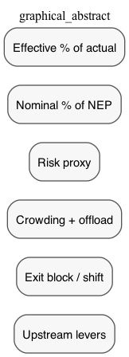
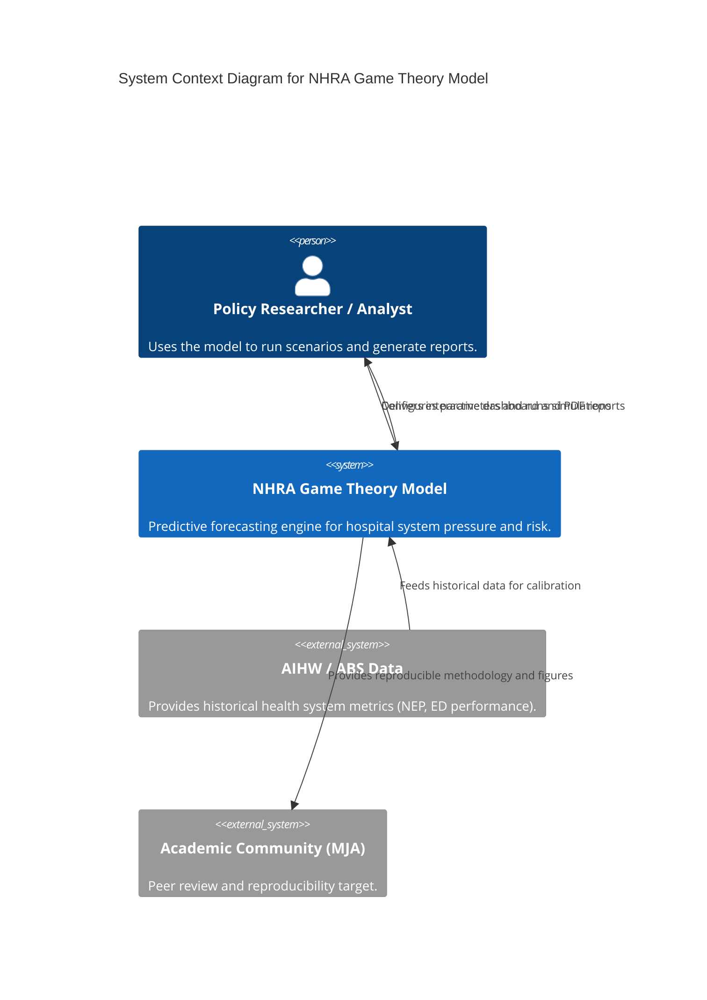
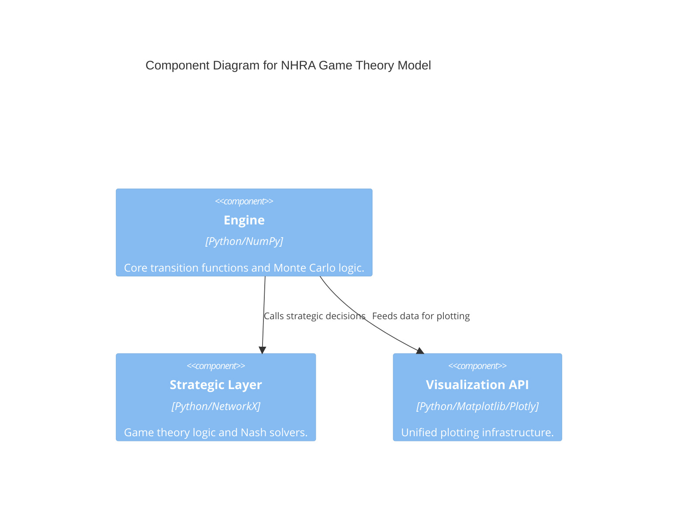
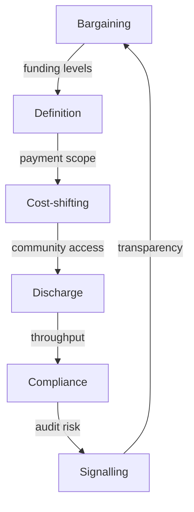

# NHRA Game Theory: Cognitive Digital Twin



[](https://github.com/edithatogo/nhra_game)
[](https://opensource.org/licenses/MIT)
[](https://www.python.org/downloads/)
[](https://github.com/astral-sh/ruff)
[](https://github.com/edithatogo/nhra_game)

**State-of-the-Art (SOTA) decision-grade game-theory mechanism models for National Health Reform Agreement (NHRA) negotiations.**

This project implements a **Cognitive Digital Twin** of the Australian health funding system. It simulates strategic interactions between Commonwealth and State actors, mapping high-level negotiation choices to monthly operational states (access block, ED crowding, ambulance offload).

📖 **Live Documentation:** [https://edithatogo.github.io/nhra_game/](https://edithatogo.github.io/nhra_game/)

---

## 🏛️ System Architecture (C4 Model)

### Level 1: System Context
The model serves as a methodological bridge between empirical data (AIHW/ABS) and policy decision-making.



### Level 3: Internal Components
Modular design separating strategic intent from operational execution.



---

## 🎯 Evidence-Linked Capabilities

| Feature | Maturity | Verification | Evidence Source |
|---|---|---|---|
| **Stochastic Simulation** | **STABLE** | `tests/test_engine_smoke.py` | [Assumptions Log](context/05_assumptions_log.md) |
| **Multi-Game Equilibria** | **STABLE** | `tests/test_subgames_nash.py` | [Game Theory Spec](context/03_model_overview.md) |
| **45% Cth Share Logic** | **STABLE** | `context/grounding.ok` | [NHRA Agreement](https://www.publichospitalfunding.gov.au/) |
| **Cognitive DT Engine** | **ALPHA** | `tests/test_engine_smoke.py` | [Strategic Map](context/02_system_map.md) |

[Full Feature Matrix & Maturity Grades →](docs/feature_matrix.md)

---

## 🚀 Quick Start

### 1. Installation
```bash
git clone https://github.com/edithatogo/nhra_game.git
cd nhra_game
poetry install
```

### 2. Launch War Room (Dashboard)
```bash
just dashboard
```

### 3. Run Pipeline
```bash
just run
```

---

## 📂 Logic & Workflows (ODD Protocol)

### Strategic Chain of Influence
How negotiation choices propagate through the system.



---

## 👩‍💻 High-Integrity Development

We adhere to the **Conductor** spec-driven development framework:
- **TDD:** >95% code coverage required for all core modules.
- **Safety:** Automated security scanning via `bandit` and `safety`.
- **Integrity:** Pydantic V2 runtime validation for all simulation parameters.

---

## 📚 Citation & Metadata

If you use this model in your research, please cite:

```bibtex
@software{Mordaunt_NHRA_Game_Theory_2025,
  author = {Mordaunt, Dylan},
  title = {NHRA Game Theory Model: A Cognitive Digital Twin for Public Hospital Funding},
  version = {26.0.0},
  year = {2025},
  url = {https://github.com/edithatogo/nhra_game}
}
```

[CITATION.cff](CITATION.cff) | [zenodo.json](zenodo.json)