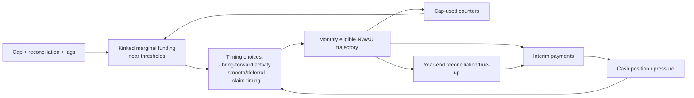
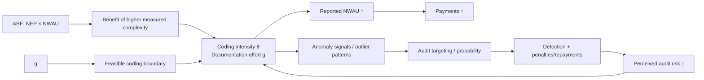

# NHRA Priority Behaviours: Mermaid Diagrams

**Source:** User provided text (December 2025)
**Context:** Visual maps for the 8 priority strategic behaviours identified for the NHRA simulation.

---

## 1) Threshold & timing behaviour


---

## 2) Coding intensity / complexity drift


---

## 3) ABF ↔ block (boundary / classification shifting)
```mermaid
%%{init: {"flowchart":{"curve":"basis","nodeSpacing":55,"rankSpacing":70}}}%%
flowchart LR
  Elig[Eligibility rules\n(ABF vs block)] --> Classify[Classification choices\n(service/episode boundary)]
  Classify --> ABF[ABF stream\nNEP×NWAU]
  Classify --> Block[Block stream\nenvelope]
  ABF --> Margin[High marginal return]
  Block --> Margin2[Low/flat marginal return]
  Margin --> Classify
  Margin2 --> Classify
  Classify --> Obs[Observed stream shares\n& sudden boundary shifts]
  Elig --> Obs
```

---

## 4) Capacity-constrained access dynamics
```mermaid
%%{init: {"flowchart":{"curve":"basis","nodeSpacing":55,"rankSpacing":70}}}%%
flowchart LR
  Demand[Arrivals: ED + electives] --> Queue[Queues / backlog]
  Capacity[Staff + beds + theatres] --> Throughput[Service capacity]
  Queue --> Throughput
  Throughput --> Outcomes[Wait times, breaches,\nED LOS, cancellations]
  Outcomes --> Pol[Political/reputational penalty\n(thresholded)]
  Pol --> Decisions[Operational decisions:\n- schedule\n- admit/LOS rules\n- surge/overtime]
  Decisions --> Throughput
  Decisions --> Invest[Invest in capacity/efficiency\n(with lags)]
  Invest --> Capacity
```

---

## 5) Internal contracting / delegation
```mermaid
%%{init: {"flowchart":{"curve":"basis","nodeSpacing":55,"rankSpacing":70}}}%%
flowchart LR
  State[State/Territory principal] --> Contract[Budgets + targets + KPIs\n+ reporting requirements]
  Contract --> LHN[LHN/hospital agents]
  LHN --> Actions[Local actions:\n- activity & mix\n- staffing/overtime\n- coding governance]
  Actions --> Metrics[Local KPIs + NWAU + costs]
  Metrics --> Report[Reported performance\n(lagged/aggregated)]
  Report --> State
  State --> Sanctions[Rewards/penalties\n& next-period tightening/loosening]
  Sanctions --> Contract
```

---

## 6) Cost shifting & substitution across settings
```mermaid
%%{init: {"flowchart":{"curve":"basis","nodeSpacing":55,"rankSpacing":70}}}%%
flowchart LR
  Incentives[Budget pressure + caps + KPIs] --> Shift[Substitution choices]
  Shift --> PublicHosp[Public hospital activity]
  Shift --> Private[Private care / outsourcing]
  Shift --> Community[Primary/community care]
  Shift --> AgedNDIS[Aged care / NDIS]
  Shift --> Ambulance[Ambulance / ED presentations]
  PublicHosp --> KPIs[Observed KPIs\n(wait, LOS, readmit)]
  Community --> KPIs
  Ambulance --> KPIs
  KPIs --> Incentives
  Externality[External costs borne elsewhere] --> Politics[Political pressure]
  Politics --> Incentives
```

---

## 7) Audit / integrity “arms race”
```mermaid
%%{init: {"flowchart":{"curve":"basis","nodeSpacing":55,"rankSpacing":70}}}%%
flowchart LR
  Provider[Providers] --> Behav[Gaming/optimisation choices\n(θ, timing, boundary shifts)]
  Behav --> Signals[Anomaly signals\n(outliers, spikes, mix shifts)]
  Signals --> Auditor[Auditor/integrity actor]
  Auditor --> Target[Targeting + intensity choices]
  Target --> Detect[Detections + penalties]
  Detect --> Provider
  Target --> Deterrence[Expected penalty ↑]
  Deterrence --> Behav
  Cost[Audit cost + false positives] --> Auditor
```

---

## 8) Renegotiation & side-payments
```mermaid
%%{init: {"flowchart":{"curve":"basis","nodeSpacing":55,"rankSpacing":70}}}%%
flowchart LR
  Clock[Deadline / schedule expiry] --> Bargain[Bargaining stage\n(offers/counteroffers)]
  Bargain --> Threats[Outside options\n(extension, walk-away)]
  Threats --> Bargain
  Bargain --> Deal[New ruleset:\nshares, caps, side-payments]
  Deal --> Rules[Rules applied in operations]
  Rules --> Outcomes[Observed performance\n(cost, access, queues)]
  Outcomes --> Narrative[Public signals & narratives\n(crisis vs success)]
  Narrative --> Bargain
  Deal --> SidePay[Side-payments / one-offs]
  SidePay --> Outcomes
```

---

## Combined Strategic Map
```mermaid
%%{init: {"flowchart":{"curve":"basis","nodeSpacing":50,"rankSpacing":65}}}%%
flowchart TB
  R[Rules engine:\nNEP/weights, eligibility,\ncap, reconciliation] --> T[1) Timing & thresholds]
  R --> B[3) Boundary shifting]
  R --> C[2) Coding drift]
  R --> A[4) Access under capacity]

  A --> P[Political threshold penalties]
  P --> T
  P --> G[8) Renegotiation dynamics]

  C --> I[7) Audit arms race]
  I --> C

  S[5) Internal contracting] --> C
  S --> A
  S --> T

  X[6) Cost shifting/substitution] --> A
  X --> P
```
