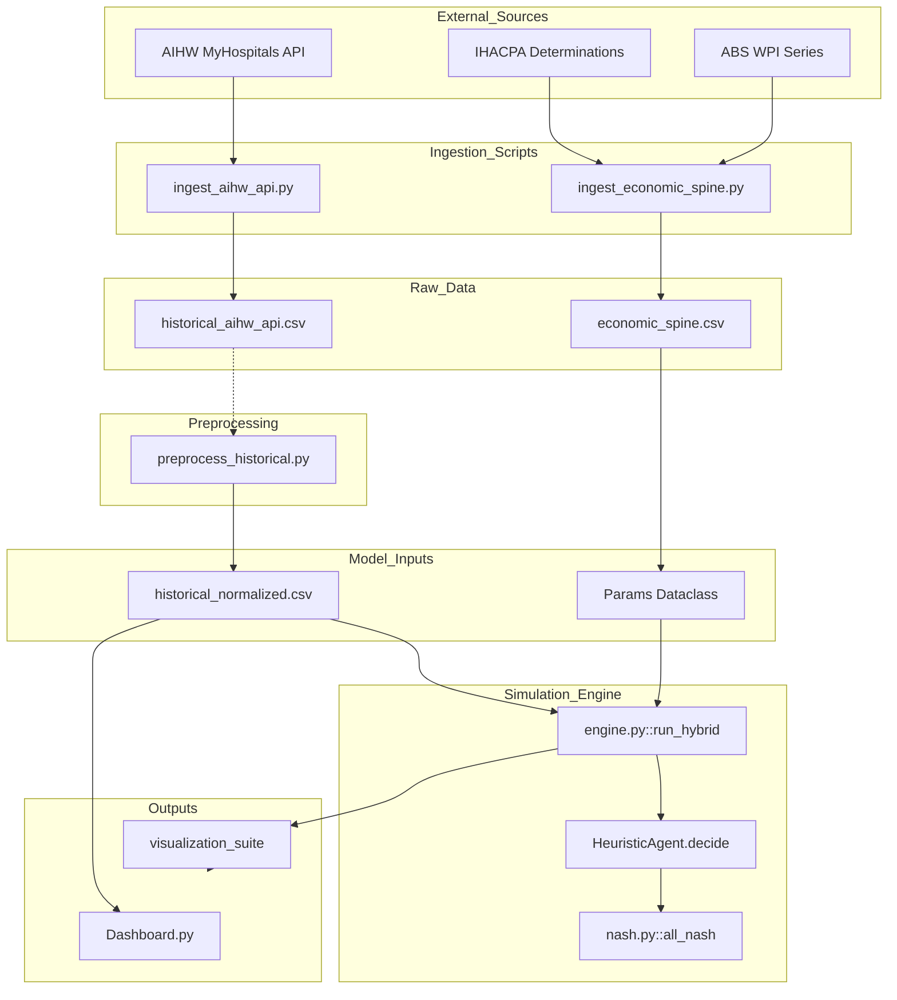

# System Diagram: Data Flow

```mermaid
graph TD
    subgraph External_Sources
        AIHW[AIHW MyHospitals API]
        IHACPA[IHACPA Determinations]
        ABS[ABS WPI Series]
    end

    subgraph Ingestion_Scripts
        AIHW_ING[ingest_aihw_api.py]
        SPINE_ING[ingest_economic_spine.py]
    end

    subgraph Raw_Data
        AIHW_RAW[historical_aihw_api.csv]
        SPINE_RAW[economic_spine.csv]
    end

    subgraph Preprocessing
        PRE[preprocess_historical.py]
    end

    subgraph Model_Inputs
        NORM[historical_normalized.csv]
        PARAMS[Params Dataclass]
    end

    subgraph Simulation_Engine
        ENG[engine.py::run_hybrid]
        AGENT[HeuristicAgent.decide]
        NASH[nash.py::all_nash]
    end

    subgraph Outputs
        VIZ[visualization_suite]
        DASH[Dashboard.py]
    end

    AIHW --> AIHW_ING
    AIHW_ING --> AIHW_RAW
    
    IHACPA --> SPINE_ING
    ABS --> SPINE_ING
    SPINE_ING --> SPINE_RAW
    
    AIHW_RAW -.-> PRE
    SPINE_RAW --> PARAMS
    
    PRE --> NORM
    NORM --> DASH
    NORM --> ENG
    
    PARAMS --> ENG
    ENG --> AGENT
    AGENT --> NASH
    ENG --> VIZ
    VIZ --> Outputs
```
