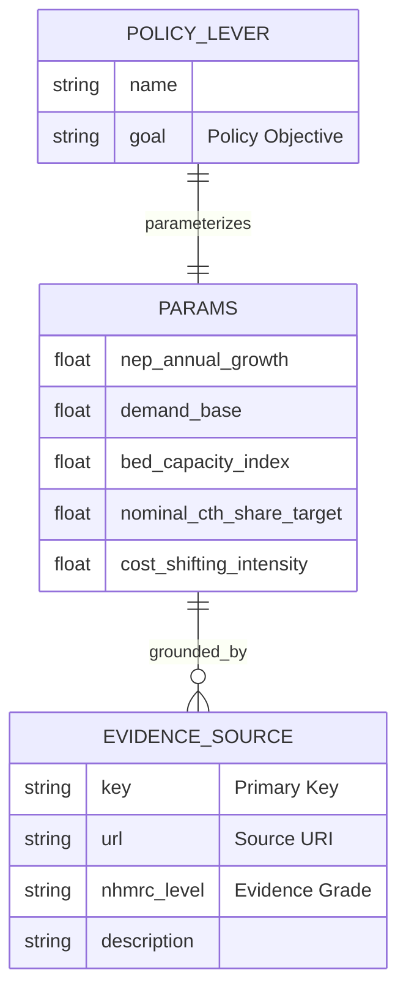
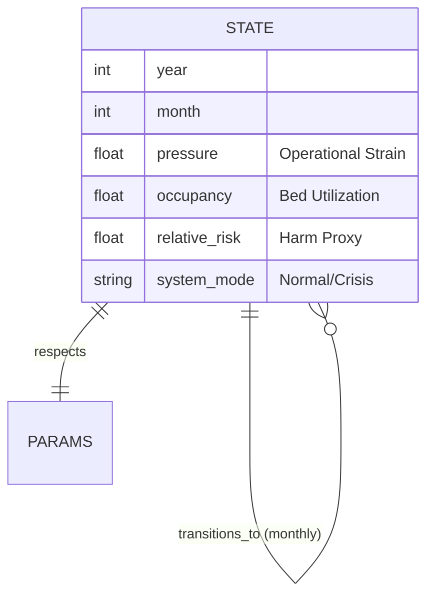
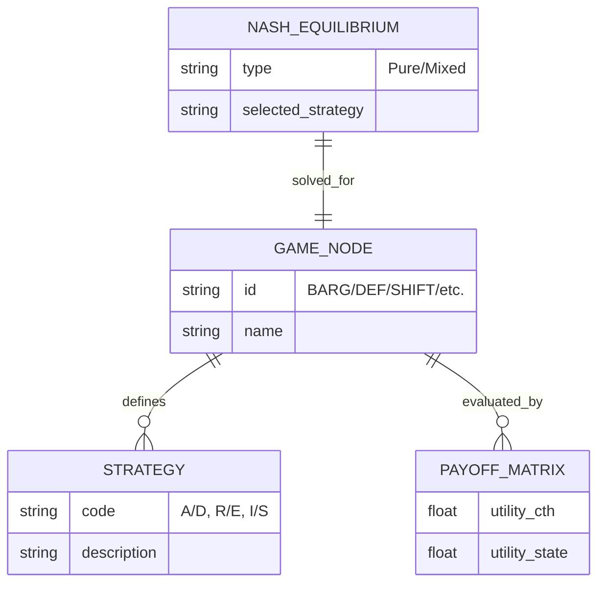
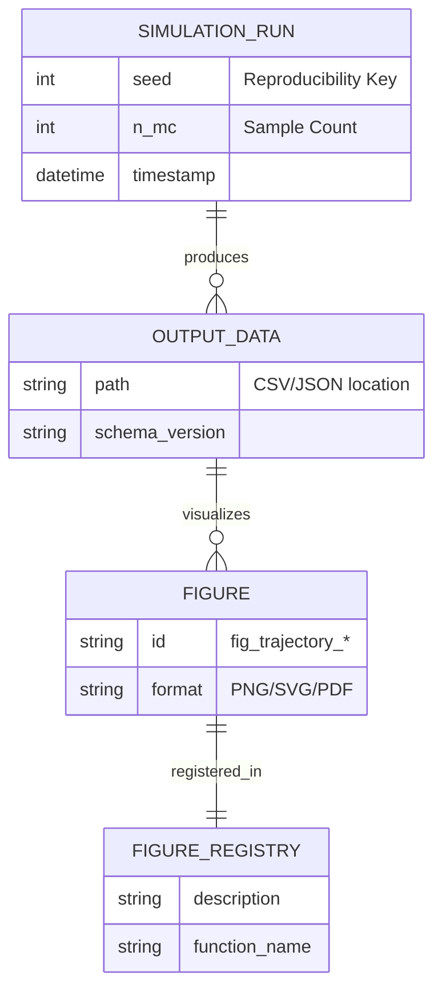

# Entity-Relationship Diagrams (Grounded Architecture)

These diagrams define the logical data models and integrity constraints of the NHRA Game Theory simulation.

## ER-A: Grounded Parameters & Evidence
Maps simulation parameters to their empirical grounding and policy sources.

## ER-B: State Vectors & Temporal Transitions
Defines the schema of simulation states and how they evolve over time.

## ER-C: Strategic Nodes & Equilibria
Models the game theory layer, including payoffs and Nash equilibria.

## ER-D: Provenance & Artifacts
Tracks the lineage from simulation runs to output figures and reports.

