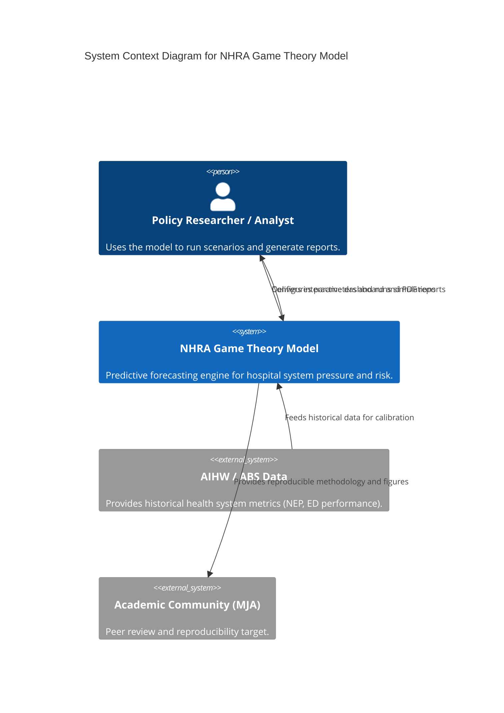
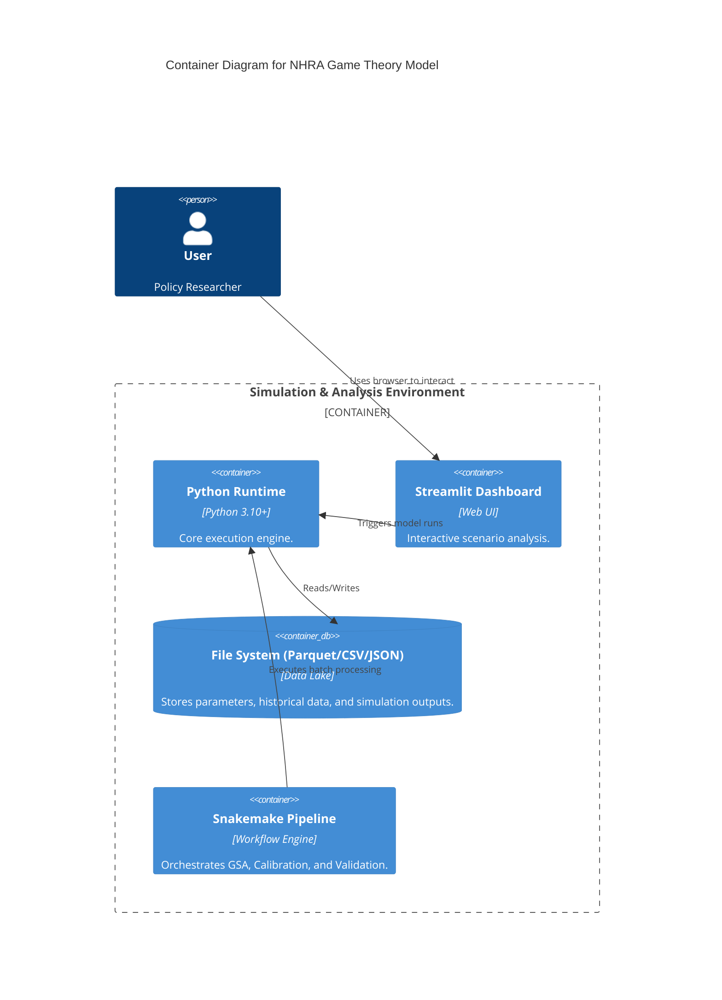
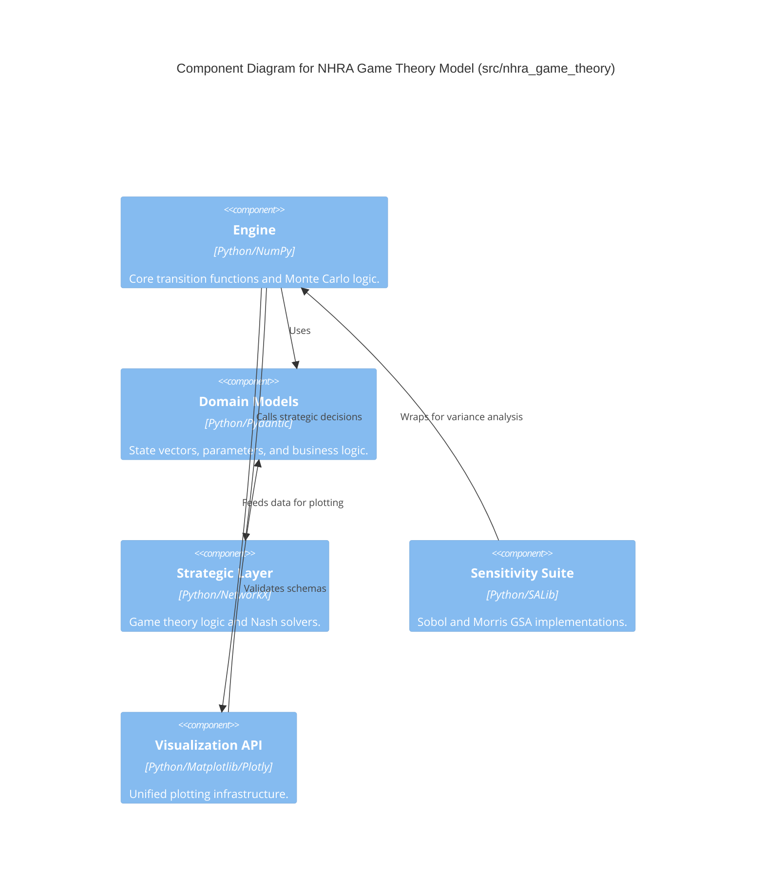

# Engineering Diagrams (C4 Model)

These diagrams follow the C4 model to represent the system architecture at different levels of abstraction.

## Level 1: System Context
Shows the NHRA Model in the context of its users and external data sources.

## Level 2: Container Diagram
Explores the high-level technology choices and data boundaries.

## Level 3: Component Diagram (Source Structure)
Details the internal module relationships within the Python package.

