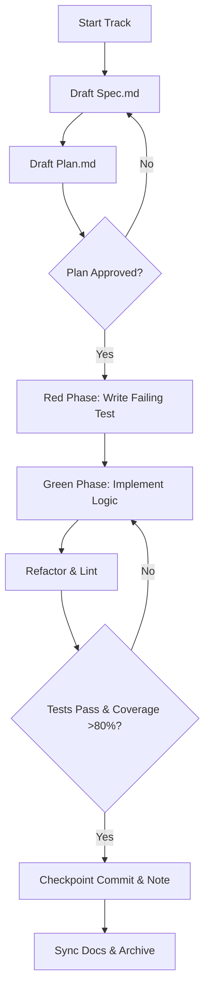
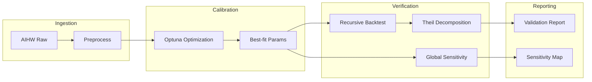
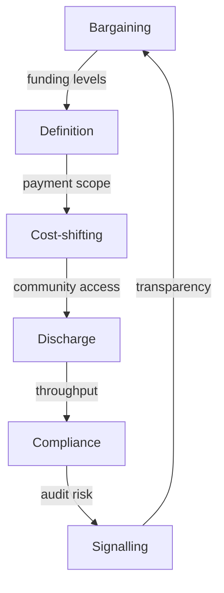
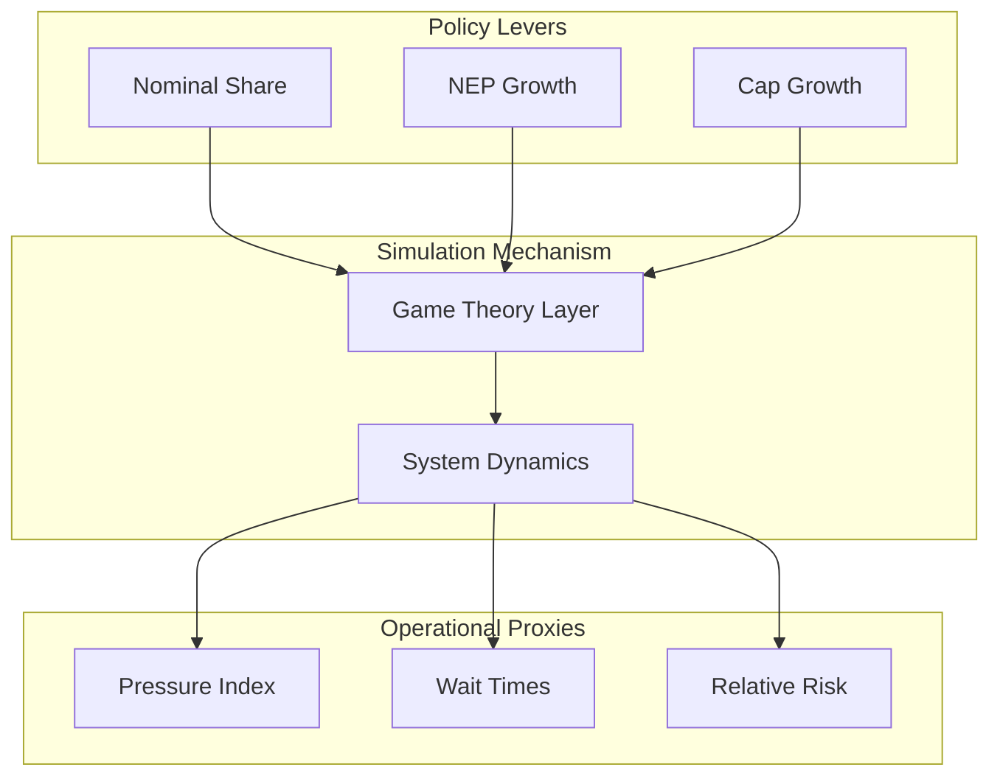

# Workflow & Logic Diagrams (ODD Protocol)

These diagrams describe the project's processes and the conceptual logic of the simulation.

## Flow-A: Development Lifecycle (Conductor + TDD)
Standardized process for feature implementation and quality assurance.

## Flow-Data: Evidence-to-Output Pipeline
The data science workflow from raw data to validated policy reports.

## Flow-GameTheory: Strategic Chain of Influence
How strategic choices propagate through the simulation mechanism.

## Flow-Conceptual: Mechanism Map
High-level overview for non-technical stakeholders.

