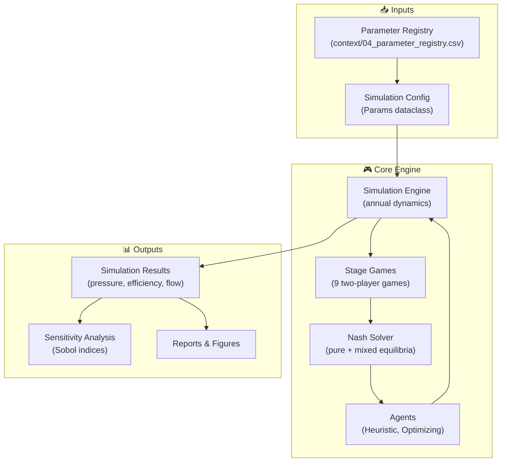
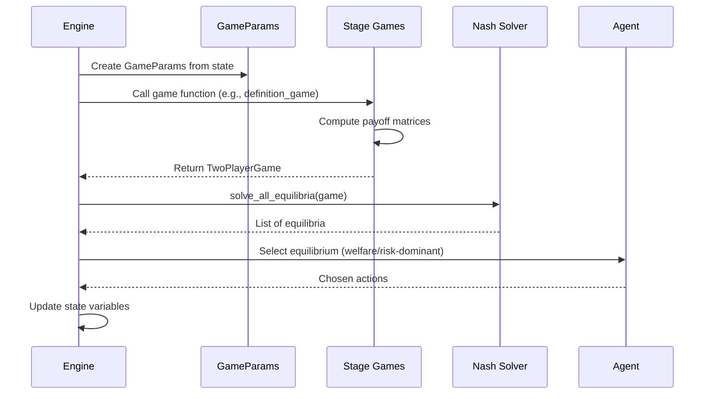
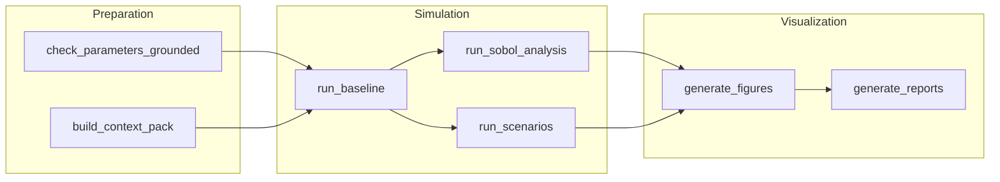
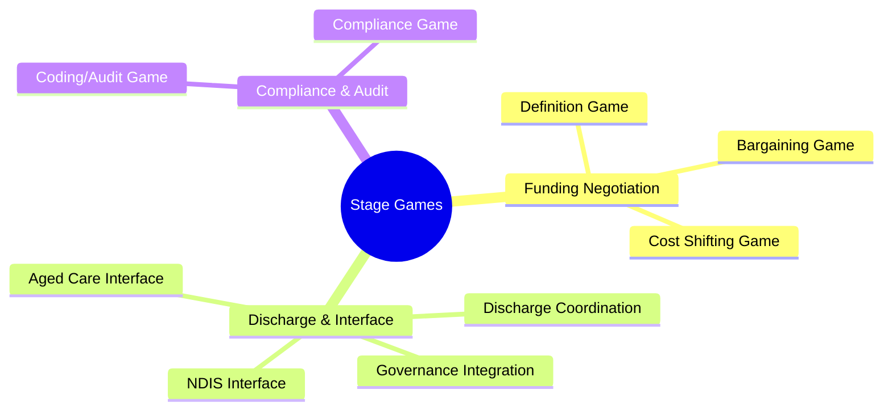
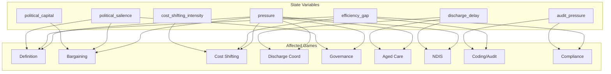

# Architecture Diagrams

This page contains architecture and flow diagrams for the NHRA Game Theory toolkit.

---

## System Architecture

---

## Game Flow

---

## Data Pipeline (Snakemake DAG)

---

## Stage Game Categories

---

## Parameter Dependencies

---

## See Also

- [Design Documentation](design.md) for architecture details
- [Models Reference](guides/models.md) for game specifications
