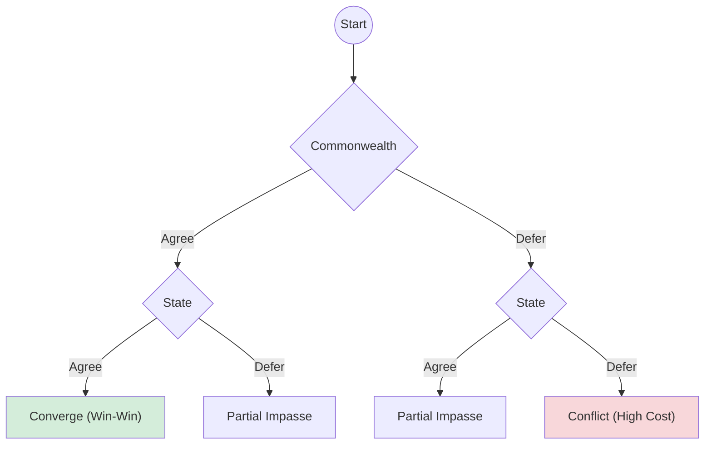

# Game Theory Models

This document provides a canonical reference for all strategic subgames in the NHRA simulation. Each game encodes an interaction between stakeholders (Commonwealth, States, Hospital Networks, Auditors) and is resolved using Nash Equilibrium or Quantal Response logic.

## Master Game Index

| ID | Canonical Function | Status | Players (Row / Col) | Actions | Key Inputs |
|:---:|:---|:---:|:---|:---|:---|
| **DEF** | `definition_game` | ✅ Active | Commonwealth / States | R, E | $\phi$, $\epsilon$, $\pi$ |
| **BARG** | `bargaining_game` | ✅ Active | Commonwealth / States | A, D | $\phi$, $\pi$, $\kappa$ |
| **SHIFT** | `cost_shifting_game` | ✅ Active | Hospital / Other Jurisdiction | I, S | $\phi$, $\epsilon$, $\sigma$ |
| **AGED** | `aged_care_interface_game` | ✅ Active | Hospital / Aged Care | C, F | $\phi$, $\delta$ |
| **NDIS** | `ndis_interface_game` | ✅ Active | Hospital / NDIS | C, F | $\phi$, $\delta$ |
| **CODING** | `coding_audit_game` | ✅ Active | Provider / Auditor | H, U / L, T | $\epsilon$, $\alpha$ |
| **COMP** | `compliance_game` | ✅ Active | Symmetric | T, L | $\epsilon$, $\alpha$ |
| **GOV** | `governance_integration_game` | ✅ Active | Commonwealth / States | I, S | $\phi$, $\pi$ |
| **DISC** | `discharge_coordination_game` | ⚠️ Legacy | Hospital / Aged Care | C, F | $\phi$, $\delta$ |
| **SIGNAL** | Heuristic (softmax) | ✅ Active | Commonwealth | H, L | $\phi$ |

> **Legend**: $\phi$ = Pressure, $\epsilon$ = Efficiency Gap, $\delta$ = Discharge Delay, $\pi$ = Political Salience, $\alpha$ = Audit Pressure, $\sigma$ = Cost Shifting Intensity, $\kappa$ = Political Capital.

---

## Parameter Schema (`GameParams`)

| Parameter | Symbol | Range | Description |
|:---|:---:|:---:|:---|
| Pressure | $\phi$ | 0.8–1.5 | System stress. >1.0 = strain; >1.2 = stress; >1.5 = crisis. |
| Efficiency Gap | $\epsilon$ | 0.0–0.6 | Divergence between NEP and actual costs. |
| Discharge Delay | $\delta$ | 0.75–1.5 | Patient length-of-stay multiplier. |
| Political Salience | $\pi$ | 0.0–1.0 | Public/media visibility of the issue. |
| Audit Pressure | $\alpha$ | 0.0–1.0 | Intensity of compliance scrutiny. |
| Cost Shift Intensity | $\sigma$ | 0.0–1.0 | Structural ease of cost shifting. |
| Political Capital | $\kappa$ | 0.0–2.0 | Reservoir of trust/goodwill. |

---

## Detailed Game Specifications

### 1. Definition Game (`DEF`)
Models the contest over the definition of "efficient pricing".

| Cell | Row Payoff | Col Payoff |
|:---:|:---|:---|
| (R, R) | $1 + B_r - C_r$ | $1 + B_r - 0.15$ |
| (R, E) | $1 - 0.15 - C_r$ | $1 - 0.20$ |
| (E, R) | $1 + B_s - C_s$ | $1 - 0.35$ |
| (E, E) | $1 - 0.45 - C_s$ | $1 - 0.55$ |

Where: $B_r = 0.5 + 0.8\epsilon + 0.4(\phi-1)$, $C_r = 0.25 + 0.35\pi$, $B_s = 0.35 + 0.45\pi$, $C_s = 0.30 + 0.50\phi$.

---

### 2. Bargaining Game (`BARG`)
Models the negotiation over the Commonwealth contribution share.

| Cell | Row Payoff | Col Payoff |
|:---:|:---|:---|
| (A, A) | $1 + G_c - 0.1\pi$ | $1 + G_c - 0.05\pi$ |
| (A, D) | $1 - 0.25 - 0.15\phi$ | $1 - 0.30 - 0.2\phi$ |
| (D, A) | $1 + G_n - 0.1\phi$ | $1 - 0.20$ |
| (D, D) | $1 - C_{conf}$ | $1 - C_{conf}$ |

Where: $G_c = 0.45 + 0.25(\phi-1) + 0.2\kappa$, $G_n = 0.25 + 0.5\pi$, $C_{conf} = 0.55 + 0.9\phi$.

---

### 3. Cost Shifting Game (`SHIFT`)
Models the incentive to invest upstream vs shift costs downstream.

| Cell | Row Payoff | Col Payoff |
|:---:|:---|:---|
| (I, I) | $1 + G_{coop} - C_\phi$ | $1 + G_{coop} - C_\phi$ |
| (I, S) | $1 - 0.25 - C_\phi$ | $1 + G_s - 0.35\phi$ |
| (S, I) | $1 + G_s - 0.35\phi$ | $1 - 0.25 - C_\phi$ |
| (S, S) | $1 - 0.60 - \phi$ | $1 - 0.60 - \phi$ |

Where: $G_{coop} = 0.55 + 0.45(1-\epsilon)$, $G_s = 0.35 + 0.75\epsilon + \sigma$, $C_\phi = 0.65\phi$.

---

### 4. Aged Care Interface (`AGED`)
Symmetric coordination game for patient discharge.

| Cell | Row/Col Payoff |
|:---:|:---|
| (C, C) | $1 + 0.6 + 0.4(\delta - 1)$ |
| (C, F) | $1.0$ |
| (F, C) | $1.0$ |
| (F, F) | $1 - 0.5\phi$ |

---

### 5. NDIS Interface (`NDIS`)
Similar structure to Aged Care, with different coefficients.

| Cell | Row/Col Payoff |
|:---:|:---|
| (C, C) | $1 + 0.5 + 0.5(\delta - 1)$ |
| (C, F) | $1.0$ |
| (F, C) | $1.0$ |
| (F, F) | $1 - 0.6\phi$ |

---

### 6. Coding Game (`CODING`)
Asymmetric game between Provider (Row) and Auditor (Col).

| Cell | Row Payoff | Col Payoff |
|:---:|:---|:---|
| (H, L) | $1.0$ | $1.0$ |
| (H, T) | $1.0$ | $1 - 0.2$ |
| (U, L) | $1 + G_u$ | $1.0$ |
| (U, T) | $1 + G_u - 0.8\alpha$ | $1 - 0.2 + 0.4\epsilon$ |

Where: $G_u = 0.3 + 0.7\epsilon$.

---

### 7. Compliance Game (`COMP`)
Symmetric game regarding administrative overhead vs system integrity.

| Cell | Row Payoff | Col Payoff |
|:---:|:---|:---|
| (T, T) | $1 - A + 0.15$ | $1 - 0.10$ |
| (T, L) | $1 - A$ | $1 - 0.35\alpha$ |
| (L, T) | $1 + L$ | $1 - L$ |
| (L, L) | $1 + L - 0.8\alpha$ | $1 - 0.35\alpha + 0.2$ |

Where: $L = 0.4 + 0.7\epsilon$, $A = 0.18 + 0.45\alpha$.

---

### 8. Governance Integration (`GOV`)
Models the structural choice between integrated governance vs separation.

| Cell | Row Payoff | Col Payoff |
|:---:|:---|:---|
| (I, I) | $1 + S - C_i$ | $1 + S - 0.10$ |
| (I, S) | $1 - 0.25 - C_i$ | $1 - 0.20$ |
| (S, I) | $1 + 0.1 - R_f$ | $1 - 0.35$ |
| (S, S) | $1 - 0.45 - R_f$ | $1 - 0.55$ |

Where: $S = 0.55 + 0.35(\phi - 1)$, $C_i = 0.20 + 0.35\pi$, $R_f = 0.40 + 0.60\phi$.

---

### 9. Signaling Mechanism (`SIGNAL`)
Heuristic-based probabilistic signaling (not a matrix game).

$$
P(\text{High}) = \text{softmax}\left( \frac{u_H}{\tau}, \frac{u_L}{\tau} \right)_1
$$

Where: $u_H = 0.10 + 0.30(\phi - 1)$, $u_L = 0.05 - 0.10(\phi - 1)$, $\tau = 0.25$.

---

## Appendix: Legacy/Experimental Games

### Discharge Coordination (`DISC`)
> **Status**: ⚠️ Defined in `games.py` but only used by `legacy_engine.py`. The `HeuristicAgent` uses `aged_care_interface_game` instead.

| Cell | Row Payoff | Col Payoff |
|:---:|:---|:---|
| (C, C) | $1 + B - C - P_\phi$ | $1 + B - C - P_\phi$ |
| (C, F) | $1 - 0.40 - P_\phi$ | $1 - 0.35 - P_\phi$ |
| (F, C) | $1 - 0.25 - P_\phi$ | $1 - 0.25 - P_\phi$ |
| (F, F) | $1 - 0.70 - 1.1\phi$ | $1 - 0.70 - \phi$ |

Where: $B = 0.70 + 0.80 \cdot \max(0, \delta - 1)$, $C = 0.30 + 0.10(1 - \min(1, \delta - 1))$, $P_\phi = 0.45\phi$.

---

## Technical Backend

*   **NumPy**: Matrix operations.
*   **`nhra_gt.subgames.nash`**: Custom pure-strategy Nash solver.
*   **Equilibrium Selection**: `payoff_dominant` or `risk_dominant`.
