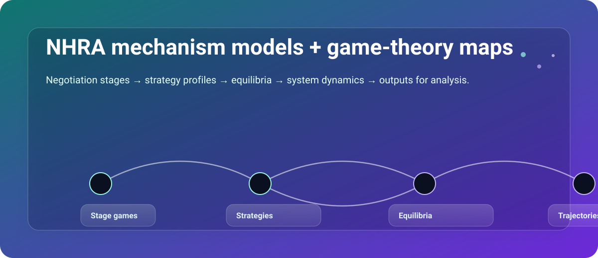
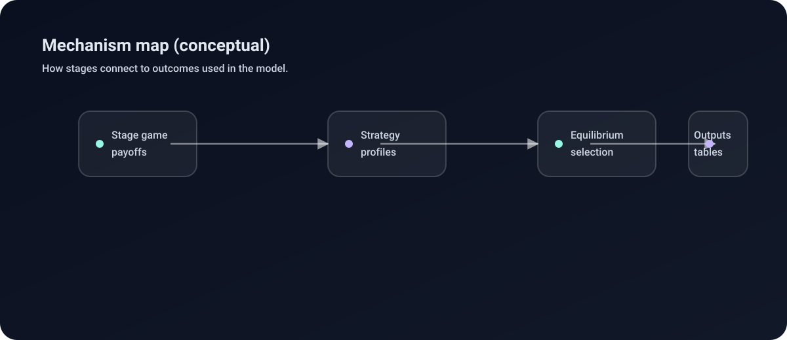
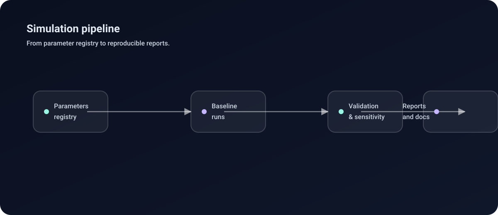

# Welcome to NHRA Game

**Stylised mechanism models for NHRA negotiations and downstream system pressure.**

This documentation provides details on the simulation models, game theory mechanisms, and analysis tools used in the project.

{ width="1200" }

-   :material-book-open-page-variant: **Guides**

    Detailed guides on usage, profiling, and development workflows.

    [:arrow_right: Explore Guides](guides/index.md)

-   :material-chart-bell-curve-cumulative: **Models**

    Technical specifications of the game theory mechanisms and simulation logic.

    [:arrow_right: View Models](guides/models.md)

-   :material-clipboard-text-outline: **Project**

    Requirements, design documents, and task tracking.

    [:arrow_right: Project Docs](project/index.md)

-   :material-api: **API Reference**

    Auto-generated Python API reference for the `nhra_gt` package.

    [:arrow_right: API Reference](reference/index.md)

## At a glance

<figure markdown>
  { width="1200" }
  <figcaption>How negotiation stages connect to strategies, equilibria, and outputs.</figcaption>
</figure>

<figure markdown>
  { width="1200" }
  <figcaption>From parameter registry → baseline runs → validation → reports and documentation.</figcaption>
</figure>

## Key Features

*   **Mechanism Design**: Custom game-theory models for hospital funding negotiations.
*   **Safety Theatre**: Simulation of "Safety Theatre" dynamics in high-reliability organizations.
*   **Validation**: Rigorous validation suite including sensitivity analysis and backtesting.

## Getting Started

Check out the [Usage Guide](guides/usage.md) to get up and running with the simulation.
