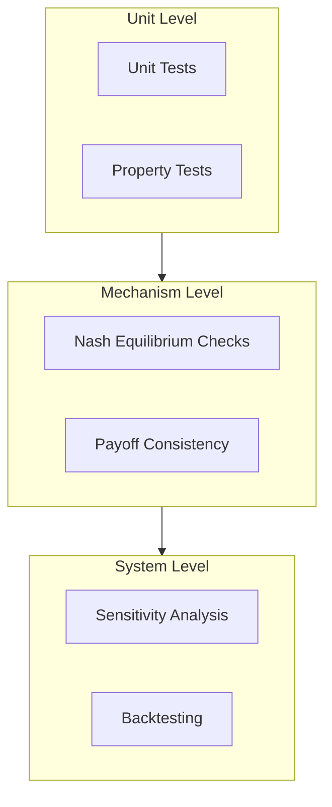

# Validation & Testing

This page documents the validation framework and testing approach for the NHRA Game Theory toolkit.

---

## Validation Philosophy

The model follows a **multi-layer validation** approach:



---

## Unit Testing

### Test Suite

Tests are located in `tests/` and run with pytest:

```bash
# Run all tests
poetry run pytest

# Run with verbose output
poetry run pytest -v

# Run specific test file
poetry run pytest tests/test_games.py
```

### Coverage Requirements

Coverage is enforced at **95%** minimum:

```bash
poetry run pytest --cov=src/nhra_gt --cov-report=html --cov-fail-under=95
```

### Property-Based Testing

We use [Hypothesis](https://hypothesis.readthedocs.io/) for property-based testing:

```python
from hypothesis import given, strategies as st

@given(st.floats(min_value=0.5, max_value=2.0))
def test_pressure_bounds(pressure):
    """Payoffs should be finite for valid pressure range."""
    gp = GameParams(pressure=pressure, ...)
    game = definition_game(gp)
    assert np.isfinite(game.u_row).all()
```

---

## Mechanism Validation

### Nash Equilibrium Verification

For each game, we verify:

1. **Existence**: At least one equilibrium exists
2. **Best Response**: Each strategy is a best response
3. **Stability**: Small perturbations don't break equilibrium

```python
def test_nash_existence():
    """Every game should have at least one Nash equilibrium."""
    gp = GameParams(pressure=1.0, efficiency_gap=0.3, ...)

    for game_fn in [definition_game, bargaining_game, cost_shifting_game]:
        game = game_fn(gp)
        equilibria = solve_all_equilibria(game)
        assert len(equilibria) >= 1
```

### Payoff Monotonicity

Key payoff relationships are verified:

| Condition | Expected Outcome |
|-----------|-----------------|
| ↑ Pressure | ↑ Coordination incentive |
| ↑ Efficiency gap | ↑ Cost shifting temptation |
| ↑ Audit pressure | ↓ Upcoding incentive |

```python
def test_pressure_monotonicity():
    """Higher pressure should increase coordination payoffs."""
    gp_low = GameParams(pressure=0.8, ...)
    gp_high = GameParams(pressure=1.5, ...)

    game_low = discharge_coordination_game(gp_low)
    game_high = discharge_coordination_game(gp_high)

    # Coordination payoff should be higher under pressure
    assert game_high.u_row[0, 0] > game_low.u_row[0, 0]
```

---

## Sensitivity Analysis

### Sobol Global Sensitivity

We use [SALib](https://salib.readthedocs.io/) for Sobol sensitivity analysis:

```bash
# Run sensitivity analysis
poetry run python scripts/run_sobol_analysis.py --samples 1024
```

This produces:
- First-order indices (S1): Direct effect of each parameter
- Total-order indices (ST): Total effect including interactions

### Key Findings

Typical sensitivity rankings (parameter importance for system pressure):

| Rank | Parameter | ST Index |
|------|-----------|----------|
| 1 | `cost_shifting_intensity` | ~0.65 |
| 2 | `efficiency_gap` | ~0.20 |
| 3 | `pressure` (initial) | ~0.10 |
| 4 | Other parameters | <0.05 |

---

## Recursive Backtesting

### Approach

The recursive backtest validates model dynamics against historical patterns:

```bash
poetry run python scripts/validation/recursive_backtest.py
```

The backtest:
1. Initialises from historical state (2017)
2. Runs simulation forward
3. Compares predicted vs actual trajectories
4. Uses rolling window validation

### Metrics

| Metric | Target | Description |
|--------|--------|-------------|
| RMSE | <0.15 | Root mean squared error |
| MAPE | <20% | Mean absolute percentage error |
| Direction | >70% | Correct direction of change |

---

## CI/CD Validation

All validation runs automatically in GitHub Actions:

```yaml
# Extract from .github/workflows/ci.yml
- name: Tests
  run: poetry run pytest -q

- name: Input traceability
  run: poetry run python scripts/check_parameters_grounded.py

- name: Verify Pipeline
  run: poetry run snakemake --cores 1 run_baseline context_pack --forceall
```

### Validation Gates

PRs must pass:
- [x] All unit tests
- [x] Type checking (mypy strict)
- [x] Lint/format (ruff)
- [x] Security scan (bandit)
- [x] Parameter grounding check
- [x] Pipeline verification
- [x] Documentation build

---

## Running Validation Locally

### Full Validation Suite

```bash
# Run complete validation
poetry run snakemake --cores 4 all

# Or individually:
poetry run pytest                           # Unit tests
poetry run mypy --strict src/nhra_gt        # Type check
poetry run python scripts/run_sobol_analysis.py  # Sensitivity
poetry run python scripts/validation/recursive_backtest.py  # Backtest
```

### Quick Smoke Test

```bash
# Fast validation (< 1 minute)
poetry run pytest tests/test_smoke.py -v
```

---

## See Also

- [Development Guide](dev.md) — Tooling and CI/CD details
- [Game Theory Models](guides/models.md) — Game specifications
- [Design Documentation](design.md) — Architecture overview
