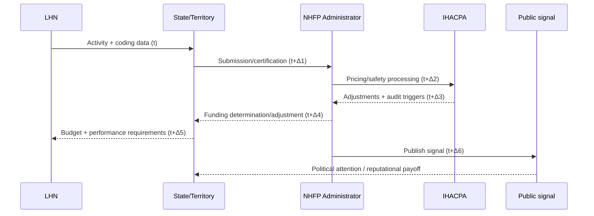

# Protocol: Structural Analysis of the National Health Reform Agreement using Game Theory (Expanded v2.1)
**Author:** Dylan A Mordaunt  
**Related preregistration:** `publications/P1_Qualitative_MJA/01_Protocol/osf_registration.md`  
**Repository data provenance:** `context/06_data_provenance.md`  
**Audit notes (examples):** `context/audit_results_verification.md`, `context/audit_results_ihacpa.md`

## Summary
This protocol specifies a qualitative document analysis of the National Health Reform Agreement (NHRA) and related statutory/policy instruments, followed by formal game-theoretic modelling. The purpose is to (1) make the incentive structure explicit as an extensive-form game with imperfect information, and (2) identify "fragility nodes" where ambiguity, information lags, or payoff misalignment make strategic gaming a rational equilibrium response.

## Abbreviations
| Abbrev. | Meaning |
| :--- | :--- |
| ABF | Activity Based Funding |
| AIHW | Australian Institute of Health and Welfare |
| HAC | Hospital Acquired Complication |
| IAD | Institutional Analysis and Development |
| IHACPA | Independent Health and Aged Care Pricing Authority |
| KPI | Key Performance Indicator |
| LHN | Local Health Network |
| NEP | National Efficient Price |
| NHFB | National Health Funding Body |
| NHFP | National Health Funding Pool |
| NHRA | National Health Reform Agreement |
| NWAU | National Weighted Activity Unit |
| PRISMA-ScR | PRISMA extension for scoping reviews |
| PSI-90 | Patient Safety Indicator 90 |
| SRQR | Standards for Reporting Qualitative Research |

## 1. Background & Rationale
The National Health Reform Agreement (NHRA) and its addenda define the contemporary Australian intergovernmental funding architecture for public hospital services. The Agreement (and enabling legislation) formalises a shift toward Activity Based Funding (ABF) and related activity/pricing mechanisms (Council on Federal Financial Relations, 2011; Commonwealth of Australia, 2011). ABF systems are designed to align payments to activity (e.g., via National Weighted Activity Units, NWAUs), but they can also create incentives to optimise reporting and classification in ways that do not necessarily reflect underlying clinical effort or outcomes (Bevan & Hood, 2006; Mannion & Braithwaite, 2012).

In this protocol, **Strategic Gaming** refers to strategic behaviours that optimise measured performance, classification, or reported activity in response to incentives and constraints, rather than improving the underlying latent construct (e.g., true clinical quality). This is closely related to **symbolic compliance** and "performance masks" described in institutional sociology (Meyer & Rowan, 1977; DiMaggio & Powell, 1983). Under high-stakes performance measurement, organisations may converge on isomorphic reporting strategies that are rational responses to the institutional environment.

The NHRA context includes (a) multi-layered agency (Commonwealth–State/Territory–Local Health Network), (b) negotiated and periodically revised rules, and (c) **imperfect information** due to reporting lags, noisy safety/quality indicators, and audit cycles. Together, these features can be represented as a sequential game in which players act under uncertainty and respond to both financial payoffs (e.g., marginal NWAU revenue, growth caps, penalties) and reputational payoffs (e.g., public reporting signals).

While game theory is widely used to study incentives, and document analysis is an established qualitative method for analysing policy artefacts, there is limited protocol-level guidance for explicitly translating a complex intergovernmental agreement into an auditable, clause-linked extensive-form game specification (Bowen, 2009; Ostrom, 2005; Osborne & Rubinstein, 1994). This study addresses that gap by defining a transparent extraction, coding, and modelling workflow that is reproducible and reviewable.

## 2. Theoretical Framework

### 2.1 Qualitative document analysis as the base method
This protocol uses qualitative document analysis to systematically extract, code, and interpret the rules, roles, and incentive mechanisms described in legal/policy texts (Prior, 2003; Bowen, 2009). The approach is primarily deductive (mapping to an *a priori* institutional grammar), with an explicit inductive component to capture emergent gaming mechanisms not anticipated in the initial codebook (Hsieh & Shannon, 2005).

### 2.2 Institutional Analysis and Development (IAD) and the "grammar of institutions"
Elinor Ostrom’s **Institutional Analysis and Development (IAD)** framework provides a structured grammar for decomposing institutions into analyzable components (Ostrom, 2005). The IAD concept of an **action situation** is used as the bridge between policy text and game structure: an action situation describes who acts, what actions are available, what information is available, and how consequences/payoffs are allocated (Crawford & Ostrom, 1995; Ostrom et al., 1994).

We map NHRA clauses to the seven IAD rule types:
1. **Boundary rules:** Who may participate, eligibility criteria, and scope of covered services.
2. **Position rules:** Defined roles (e.g., Administrator, IHACPA, State health departments, LHN boards).
3. **Choice rules:** What actions are permitted/required (e.g., submission, certification, audit response).
4. **Information rules:** Reporting, publication, data quality requirements, and timing/lags.
5. **Payoff rules:** Transfers and penalties (e.g., NEP valuation, growth caps, safety adjustments).
6. **Aggregation rules:** How actions aggregate into binding constraints (e.g., state caps, national adjustments).
7. **Scope rules:** Service and geographic boundaries; what outcomes are in or out of scope.

### 2.3 Constructive ambiguity and multi-level principal–agent dynamics
Intergovernmental agreements frequently contain **constructive ambiguity**: policy language that is intentionally flexible to enable agreement among parties with divergent objectives. In IAD terms, ambiguity can manifest as underspecified rules, weak monitoring, or unclear aggregation logic; in game terms, it can produce "undefined states" or wide information sets that expand the equilibrium set.

The NHRA institutional setting is also well described by a multi-level **principal–agent** structure (Eisenhardt, 1989): the Commonwealth (principal) delegates implementation and service delivery to States/Territories (agents), which in turn delegate operational decisions to LHNs (sub-agents). When monitoring is imperfect and payoffs are noisy, agents may rationally substitute effort into reportable outputs rather than latent quality.

### 2.4 Game-theoretic formalisation: extensive-form, imperfect information, and reputation
The modelling target is an **extensive-form game with imperfect information**, suitable for sequential decision-making under uncertainty (Schelling, 1960; Fudenberg & Tirole, 1991; Osborne & Rubinstein, 1994). Imperfect information is operationalised via:
- **Strategic uncertainty:** uncertainty about other players’ future actions and enforcement responses.
- **Stochastic uncertainty:** noise and measurement error in observed performance signals (e.g., PSI-90-type composites, lagged reporting).

Payoffs include both financial and reputational components. The reputational component matters because public ranking signals can affect political attention, managerial incentives, and organisational legitimacy (DiMaggio & Powell, 1983; Mannion & Braithwaite, 2012).

## 3. Taxonomy of Strategic Gaming (Sensitising Framework)
To guide coding, we use a preliminary taxonomy of hypothesised gaming behaviours. This is a **sensitising framework**: categories may be revised, merged, or expanded during inductive coding (Hsieh & Shannon, 2005).

### 3.1 Financial-classification gaming
- **Upcoding (classification shifting):** strategic coding/documentation intensity to increase NWAU weight without commensurate resource use.
- **Episode fragmentation / rebundling:** shifting where activity is counted (e.g., admission/discharge timing) to maximise payable units.

### 3.2 Boundary and scope gaming
- **Cost-shifting (boundary gaming):** moving activity between ABF and block-funded streams, or between jurisdictions/pools, to bypass caps or exploit pricing differentials.
- **Service substitution:** shifting delivery to service types with more favourable valuation or weaker monitoring.

### 3.3 Information and signal management
- **Selective disclosure / timing manipulation:** managing the timing/completeness of data submissions and narrative framing to optimise public signals.
- **Audit evasion / audit shaping:** avoiding triggering thresholds, or reallocating effort toward audit-visible artefacts rather than underlying quality.

### 3.4 Political bargaining strategies
- **Hysteretic crisis response:** strategic escalation of capacity-pressure signals (e.g., "crisis declarations") to activate discretionary side-payments or political exceptions outside the formal ABF formula.

## 4. Research Questions, Objectives, and Outputs

### 4.1 Primary research questions
1. **RQ1 (Structure):** What are the key action situations implied by the NHRA and associated instruments, and how do they connect as a sequential game?
2. **RQ2 (Incentives):** Under what plausible payoff and information conditions does strategic gaming become an equilibrium response for LHNs and/or States/Territories?
3. **RQ3 (Fragility):** Which clauses/rule clusters constitute "fragility nodes" where small changes in information quality, audit intensity, or payoff weights shift the predicted equilibrium?

### 4.2 Objectives
1. **Map the formal game structure:** decompose the NHRA and addenda into a clause-linked extensive-form game specification (players, moves, information sets, payoffs).
2. **Analyse ambiguity and incoherence:** identify how constructive ambiguity and/or circular aggregation logic expands information sets or produces weakly specified payoffs.
3. **Determine equilibria under imperfect information:** analyse conditions under which gaming dominates honest effort, explicitly including reputational payoffs and monitoring/audit probability.
4. **Policy stress testing:** evaluate sensitivity to policy levers (e.g., audit pressure, publication timing, penalty strength, measurement noise; see `sources.md` and Appendix A: `appendix_ihacpa_changes.md` for year-by-year notes).

### 4.3 Pre-specified outputs (deliverables)
- A document index and clause-level extraction table (with stable document locators).
- An IAD rule map (clause → rule type) and action-situation catalogue.
- A machine-readable game specification (nodes, moves, information sets, payoffs).
- A fragility-node register: clauses/rule clusters with disproportionate strategic impact.
- A reproducible audit trail covering extraction, reconciliation, and modelling decisions.

## 5. Methods

### 5.1 Study design and epistemic stance
Design: **qualitative document analysis** followed by **formal analytic modelling** (Bowen, 2009; Osborne & Rubinstein, 1994). The qualitative phase treats policy text as an institutional artefact whose meaning is partly explicit (rules-on-paper) and partly operational (rules-in-use). The modelling phase treats the extracted structure as a formal object that can be stress tested for equilibrium behaviour under assumptions about information and payoffs.

### 5.2 Corpus and sampling strategy
This study uses a **census** of core governing instruments (primary corpus) plus a purposive set of operational and measurement instruments (secondary corpus).

**Primary corpus (census):**
- National Health Reform Agreement (2011) (Council on Federal Financial Relations, 2011).
- NHRA addenda (2017, 2020–2025) (Council on Federal Financial Relations, 2017; Council on Federal Financial Relations, 2020).
- *National Health Reform Act 2011* (Cth) (Commonwealth of Australia, 2011).

**Secondary corpus (contextual rules and signals):**
- **IHACPA Pricing Frameworks (all available years, 2012–13 to 2026–27):** the detailed rules for National Efficient Price (NEP) and National Efficient Cost (NEC) determinations, and Hospital Acquired Complications (HAC) adjustments (IHACPA, various years; full list and links in `sources.md`; see Appendix A (`appendix_ihacpa_changes.md`) for concise per‑year methodological notes).

  **IHACPA Pricing Frameworks — Year-by-year highlights (2012–13 → 2026–27):**

  | Year | Highlight |
  |------|-----------|
  | 2012–13 | First Pricing Framework and Pricing Guidelines — established governance and methodology for NEP determinations. |
  | 2013–14 | Builds on 2012–13 Pricing Guidelines; consultation submissions documented. |
  | 2014–15 | Timing change: framework published prior to NEP/NEC to increase transparency (Feb 2014; see Appendix A). [Pricing Framework](https://www.ihacpa.gov.au/resources/pricing-framework-australian-public-hospital-services-2014-15) |
  | 2015–16 | Continued methodological continuity; NEP/NEC released Mar 2015. |
  | 2016–17 | Framework builds on earlier editions; NEP/NEC published early 2016. |
  | 2017–18 | Framework continues iterative development; consultative process documented. |
  | 2018–19 | Framework issued prior to NEP/NEC for transparency (Feb 2018; see Appendix A). [Pricing Framework](https://www.ihacpa.gov.au/resources/pricing-framework-australian-public-hospital-services-2018-19) |
  | 2019–20 | Builds on prior years; NEP/NEC determinations published Mar 2019/2020. |
  | 2020–21 | Schedule and consultation adjusted to align with NHRA Addendum 2020–25 (see Appendix A). [Pricing Framework](https://www.ihacpa.gov.au/resources/pricing-framework-australian-public-hospital-services-2020-21); [NEP](https://www.ihacpa.gov.au/resources/national-efficient-price-determination-2020-21); [NEC](https://www.ihacpa.gov.au/resources/national-efficient-cost-determination-2020-21) |
  | 2021–22 | Framework published Feb 2022; schedule modified to accommodate Addendum consultations (see Appendix A). [Pricing Framework](https://www.ihacpa.gov.au/resources/pricing-framework-australian-public-hospital-services-2021-22); [NEP](https://www.ihacpa.gov.au/resources/national-efficient-price-determination-2021-22); [NEC](https://www.ihacpa.gov.au/resources/national-efficient-cost-determination-2021-22) |
  | 2022–23 | Framework published Aug 2022; documented methodology updates and consultation report (see Appendix A). [Pricing Framework](https://www.ihacpa.gov.au/resources/pricing-framework-australian-public-hospital-services-2022-23); [NEP](https://www.ihacpa.gov.au/resources/national-efficient-price-determination-2022-23); [NEC](https://www.ihacpa.gov.au/resources/national-efficient-cost-determination-2022-23) |
  | 2023–24 | Framework published Dec 2022; published ahead of NEP/NEC to provide transparency and capture consultation feedback (see Appendix A). [Pricing Framework](https://www.ihacpa.gov.au/resources/pricing-framework-australian-public-hospital-services-2023-24); [NEP](https://www.ihacpa.gov.au/resources/national-efficient-price-determination-2023-24); [NEC](https://www.ihacpa.gov.au/resources/national-efficient-cost-determination-2023-24) |
  | 2024–25 | Framework published Dec 2023; emphasis on transparency and extended technical appendices (see Appendix A). [Pricing Framework](https://www.ihacpa.gov.au/resources/pricing-framework-australian-public-hospital-services-2024-25); [NEP](https://www.ihacpa.gov.au/resources/national-efficient-price-determination-2024-25); [NEC](https://www.ihacpa.gov.au/resources/national-efficient-cost-determination-2024-25) |
  | 2025–26 | Framework published Dec 2024; NEP/NEC determinations published Mar 2025; consultation report available (see Appendix A). [Pricing Framework](https://www.ihacpa.gov.au/resources/pricing-framework-australian-public-hospital-services-2025-26); [NEP](https://www.ihacpa.gov.au/resources/national-efficient-price-determination-2025-26); [NEC](https://www.ihacpa.gov.au/resources/national-efficient-cost-determination-2025-26) |
  | 2026–27 | Framework published Dec 2025; consultation May–Jun 2025; NEP/NEC pending (Mar 2026; see Appendix A). [Pricing Framework](https://www.ihacpa.gov.au/resources/pricing-framework-australian-public-hospital-services-2026-27) |

  (If you need more than the highlights above, see `sources.md` for a full year-by‑year table with NEP/NEC links and detailed notes; see Appendix A (`appendix_ihacpa_changes.md`) for concise per‑year methodological change summaries.)
- AIHW hospital performance reporting artefacts used as public signals (AIHW, 2024).
- Public audit / review reports relevant to ABF and data quality (where included).

**Supplemental literature (scoping search):**
A scoping review of peer-reviewed and grey literature is used to contextualise known strategic responses to ABF/performance regimes and to triangulate candidate gaming behaviours. This component follows scoping review methods and reporting (Arksey & O’Malley, 2005; Levac et al., 2010; Tricco et al., 2018), and uses the inclusion/exclusion logic in `publications/P1_Qualitative_MJA/01_Protocol/criteria.md` with search strings in `publications/P1_Qualitative_MJA/01_Protocol/search_strings.md`.

### 5.3 Document retrieval, indexing, and provenance
To make the analysis auditable:
1. Each source document is retrieved from a public source and stored/linked with a stable locator (URL + retrieval date + page/section locator).
2. A document index is maintained (title, issuer, date, version, URL, checksum where feasible).
3. When extracting clauses, each coded extract includes a locator: document name + clause ID + page reference (or equivalent stable anchor).

This protocol aligns with the repository’s public-source constraint and provenance approach described in `context/06_data_provenance.md`.

### 5.4 Unit of analysis and segmentation rules
**Unit of analysis:** a "rule statement" derived from policy text, typically at the clause/subclause level, including definitions and schedule items when they define binding constraints.

**Segmentation rules:**
- Split combined clauses into separate rule statements when they define (a) a distinct actor, (b) a distinct required/prohibited action, (c) a distinct timing condition, or (d) a distinct payoff/penalty condition.
- Keep cross-references explicit (e.g., "subject to clause X") by encoding dependencies in the extraction table.

### 5.5 Coding framework and extraction procedure

#### 5.5.1 A priori codebook (deductive)
Deductive codes are defined by the IAD rule types and a minimal game-theory schema (player, move, timing, information, payoff). A preliminary "move type" dictionary is used to keep extraction consistent:
- `FundingEvent` (determination, transfer, cap adjustment)
- `ReportingEvent` (submission, certification, publication)
- `AuditEvent` (audit initiation, response, revision)
- `PenaltyEvent` (HAC/safety adjustment, noncompliance penalty)
- `NegotiationLoop` (iterative cycles defined across clauses)
- `ExceptionEvent` (escape clauses, emergency measures, ministerial discretion)

#### 5.5.2 Inductive coding
Inductive codes capture emergent mechanisms of gaming and ambiguity not fully anticipated by the taxonomy in Section 3. The inductive pass pays particular attention to:
- points where compliance is defined in output terms rather than process/effort terms,
- places where monitoring probability or data quality is underspecified,
- areas where reputational signals are published without strong linkage to controllable effort.

#### 5.5.3 Dual-pass "clean room" coding and reconciliation
To reduce single-lens bias, extraction is performed in two independent passes:
- **Pass A (rule-strict / rules-on-paper):** code only what is explicitly required/permitted by the text.
- **Pass B (context-applied / rules-in-use):** code how the rule is plausibly operationalised given implementation realities and known workaround patterns.

Each pass produces:
- a clause-level extraction table,
- a set of action situations,
- a candidate mapping from clauses to game-theory elements.

**Reconciliation:** discrepancies are resolved via documented arbitration rules:
1. Prefer statutory text (Act) over agreement language when in conflict.
2. Prefer explicit definitions over implied practice.
3. Record ambiguous interpretations as alternative branches (expanded information sets) rather than forcing a single interpretation.

### 5.6 From coded extracts to action situations and game specification
The modelling workflow proceeds as follows:
1. **Clause → rule statement:** extract and code rule statements with locators.
2. **Rule statements → action situations:** group related rule statements into action situations (who acts, what choices, what information, what outcomes).
3. **Action situations → game tree skeleton:** define player order, move sets, and timing.
4. **Information sets:** identify what each player observes at each move (including lags, audits, publication delays).
5. **Payoffs:** map explicit payoffs (NEP valuation, adjustments, penalties) and specify reputational payoff proxies driven by published signals.

The game representation is stored as an explicit graph object (nodes/edges) plus a human-readable narrative description for review.

### 5.7 Utility specification and parameterisation
At each decision node, define utility for player *i*:
$$U_i = \alpha \cdot F(a_i, \theta) + \beta \cdot R(s_i) - C(e_i)$$
Where:
- $F$ is financial payoff as a function of activity $a_i$ and classification/coding intensity $\theta$ (e.g., NWAU-weighted valuation under NEP and cap rules).
- $R$ is reputational payoff as a function of observed signal $s_i$ (public reporting, rankings, political/media attention).
- $C$ is the cost of genuine effort $e_i$ (clinical, managerial, operational).
- $\alpha, \beta$ are weights explored in sensitivity analyses rather than treated as known constants.

### 5.8 Equilibrium concepts and analyses
Primary equilibrium targets (chosen according to the information structure):
- **Subgame Perfect Equilibrium** (where the game admits proper subgames).
- **Perfect Bayesian / Sequential Equilibrium** for imperfect information variants (Osborne & Rubinstein, 1994).

Analyses include:
- identification of strategy profiles that constitute equilibrium under plausible parameter ranges,
- sensitivity analysis over audit probability, noise in signals, penalty strength, and $\alpha/\beta$ tradeoffs,
- identification of **tipping points** where equilibrium behaviour changes discontinuously.

### 5.9 Trustworthiness, quality assurance, and audit trail
This protocol uses qualitative trustworthiness criteria (Lincoln & Guba, 1985; Tracy, 2010) adapted to document analysis and formal modelling:
- **Credibility:** triangulation across primary and secondary corpus; explicit recording of alternative interpretations.
- **Dependability:** versioned extraction tables and decision logs; reproducible scripts where applicable.
- **Confirmability:** preservation of locators and quotations; reconciliation log capturing arbitration decisions.
- **Transferability:** clear definition of institutional context and boundaries; explicit limitations.

The repository includes illustrative verification artefacts for data/parameter ingestion (e.g., `context/audit_results_verification.md`), and these practices are extended to the document-extraction stage.

### 5.10 Reflexivity & bias (simulated analytical lenses)
This protocol acknowledges that any structured analytic procedure can bias interpretation toward what is easily codified. To mitigate this, the dual-pass approach operationalises divergent lenses (rule-strict vs context-applied) and forces explicit documentation of interpretive choices. Where the modelling requires assumptions (e.g., payoffs, information lags), assumptions are enumerated and stress tested rather than hidden.

### 5.11 Ethics and governance
This study uses publicly retrievable policy, statutory, and reporting documents and does not involve human participants or identifiable patient data. Formal human-research ethics approval is not expected to be required; nonetheless, governance principles are followed: transparent sourcing, careful quotation, and avoidance of confidential material.

## 6. Workflow Diagrams (Mermaid / Graphviz)

### 6.1 End-to-end protocol workflow (Mermaid)
```mermaid
flowchart TB
  subgraph Corpus
    A[Primary corpus: NHRA + Act + addenda] --> B[Document index + locators]
    A2[Secondary corpus: IHACPA + AIHW + audits] --> B
    A3[Supplemental literature (PRISMA-ScR)] --> B
  end

  B --> C1[Clean-room coding pass A\nRule-strict (rules-on-paper)]
  B --> C2[Clean-room coding pass B\nContext-applied (rules-in-use)]
  C1 --> D[Reconciliation + arbitration log]
  C2 --> D
  D --> E[IAD rule map + action situations]
  E --> F[Game specification\n(players, moves, info sets, payoffs)]
  F --> G[Graph representation\n(game tree / DAG)]
  G --> H[Equilibrium + sensitivity analyses]
  H --> I[Outputs\nfragility nodes + policy levers]
```

### 6.2 Audit / reporting loop as an information structure (Mermaid sequence)


### 6.3 Example clause → action situation → game node mapping (Graphviz)
```dot
digraph nhra_mapping_example {
  rankdir=LR;
  node [shape=box];

  Clause [label="NHRA addendum\n(eg. data quality cycle)\nClause group: 127–130"];
  IADInfo [label="IAD rule: Information\nsubmission + publication\n+ lags"];
  IADPayoff [label="IAD rule: Payoff\npenalty/adjustment\n+ incentives"];
  Action [label="Action situation:\nReport → Audit → Adjust"];
  Node [label="Game node:\nChoose effort vs gaming\nunder imperfect info"];

  Clause -> IADInfo;
  Clause -> IADPayoff;
  IADInfo -> Action;
  IADPayoff -> Action;
  Action -> Node;
}
```

## 7. Reporting Standards
This study will be reported in accordance with the **SRQR** reporting guidance for qualitative research (O’Brien et al., 2014). The supplemental scoping search will be documented using **PRISMA-ScR** (Tricco et al., 2018).

## 8. References (Bibliography)
1. AIHW. *Hospital performance reporting / Emergency Department care reporting (relevant year).* Australian Institute of Health and Welfare; 2024.
2. Arksey H, O’Malley L. Scoping studies: towards a methodological framework. *International Journal of Social Research Methodology.* 2005;8(1):19–32.
3. Bevan G, Hood C. What’s measured is what matters: targets and gaming in the English public health care system. *Public Administration.* 2006;84(3):517–538.
4. Bowen GA. Document analysis as a qualitative research method. *Qualitative Research Journal.* 2009;9(2):27–40.
5. Commonwealth of Australia. *National Health Reform Act 2011* (Cth).
6. Council on Federal Financial Relations. *National Health Reform Agreement.* 2011.
7. Council on Federal Financial Relations. *National Health Reform Agreement — Addendum.* 2017.
8. Council on Federal Financial Relations. *National Health Reform Agreement — Addendum (2020–2025).* 2020.
9. Crawford SE, Ostrom E. A grammar of institutions. *American Political Science Review.* 1995;89(3):582–600.
10. DiMaggio PJ, Powell WW. The iron cage revisited: institutional isomorphism and collective rationality in organizational fields. *American Sociological Review.* 1983;48(2):147–160.
11. Eisenhardt KM. Agency theory: an assessment and review. *Academy of Management Review.* 1989;14(1):57–74.
12. Fudenberg D, Tirole J. *Game Theory.* MIT Press; 1991.
13. Hsieh HF, Shannon SE. Three approaches to qualitative content analysis. *Qualitative Health Research.* 2005;15(9):1277–1288.
14. IHACPA. *Pricing Framework for Australian Public Hospital Services 2024–25.* Independent Health and Aged Care Pricing Authority; 2024.
15. Levac D, Colquhoun H, O’Brien KK. Scoping studies: advancing the methodology. *Implementation Science.* 2010;5:69.
16. Lincoln YS, Guba EG. *Naturalistic Inquiry.* SAGE; 1985.
17. Mannion R, Braithwaite J. Unintended consequences of performance measurement in healthcare: 20 salutary lessons from the English National Health Service. *Internal Medicine Journal.* 2012;42(5):569–574.
18. Meyer JW, Rowan B. Institutionalized organizations: formal structure as myth and ceremony. *American Journal of Sociology.* 1977;83(2):340–363.
19. O’Brien BC, Harris IB, Beckman TJ, Reed DA, Cook DA. Standards for reporting qualitative research: a synthesis of recommendations. *Academic Medicine.* 2014;89(9):1245–1251.
20. Osborne MJ, Rubinstein A. *A Course in Game Theory.* MIT Press; 1994.
21. Ostrom E. *Understanding Institutional Diversity.* Princeton University Press; 2005.
22. Ostrom E, Gardner R, Walker J. *Rules, Games, and Common-Pool Resources.* University of Michigan Press; 1994.
23. Prior L. *Using Documents in Social Research.* SAGE; 2003.
24. Schelling TC. *The Strategy of Conflict.* Harvard University Press; 1960.
25. Tracy SJ. Qualitative quality: eight “big-tent” criteria for excellent qualitative research. *Qualitative Inquiry.* 2010;16(10):837–851.
26. Tricco AC, Lillie E, Zarin W, O’Brien KK, Colquhoun H, Levac D, et al. PRISMA extension for scoping reviews (PRISMA-ScR): checklist and explanation. *Annals of Internal Medicine.* 2018;169(7):467–473.

## Appendix A. Minimal extraction template (for clause-level coding)
| Field | Description |
| :--- | :--- |
| Document | Source document name + version |
| Locator | Clause ID + page/section anchor |
| Quotation | Exact text excerpt (as needed) |
| Rule type | IAD: boundary/position/choice/information/payoff/aggregation/scope |
| Player(s) | Actor(s) implicated by the clause |
| Move type | `FundingEvent`, `ReportingEvent`, `AuditEvent`, `PenaltyEvent`, `NegotiationLoop`, `ExceptionEvent` |
| Timing | When the move occurs (and lags) |
| Information set | What is observed/known at this point |
| Payoff implication | Financial + reputational (if applicable) |
| Ambiguity note | Where interpretation branches, record alternatives |
