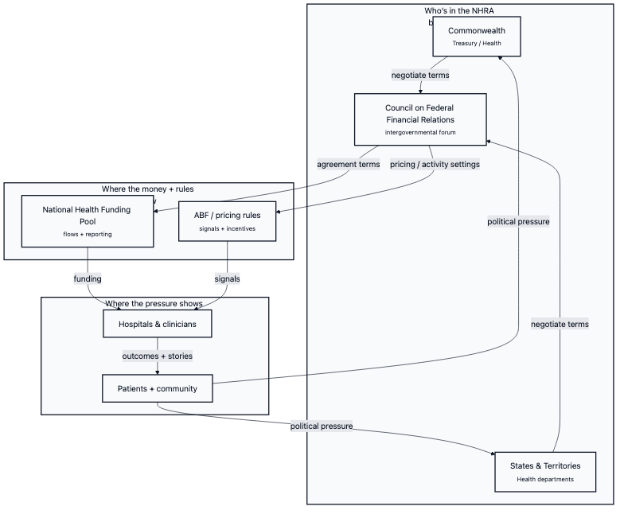
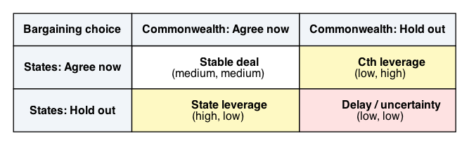
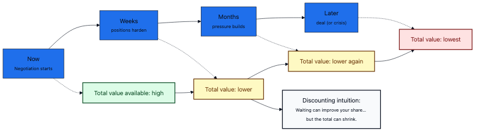

# The NHRA “Bargaining Game”: agree now, or wait for leverage?

Sometimes the most “rational” move in a negotiation is… to wait.

That sounds strange when everyone agrees the health system is under pressure.

But it happens. And game theory helps explain why.

Quick glossary (plain English):
- **NHRA**: the national deal that shapes how public hospitals are funded.
- **Bargaining**: a negotiation where each side wants a better deal.
- **“Discounting”**: a fancy word for “later matters less” (and delays can create real costs).

## The real-world situation

Under Australia’s **National Health Reform Agreement (NHRA)**, the Commonwealth and the states/territories negotiate rules and funding settings.

Sometimes the choice is basically:

- **Agree now** (certainty, but maybe you give up leverage), or
- **Hold out** (maybe you get better terms, but delay has costs).

Here’s a simple map of who’s involved and where the pressure shows up:

## A tiny example (generic on purpose)

Imagine two statements that can both be true:

- The Commonwealth wants: “Let’s sign now with clear rules and reporting.”
- A state wants: “If we wait, we might get more flexibility (or more funding certainty).”

Neither is automatically “bad”. They’re incentives.

But if both sides keep waiting for the other to blink, the system sits in uncertainty.

## The “game” hiding inside it

Let’s simplify the bargaining moment into two choices for each side:

- **Agree now**
- **Hold out**

And we’ll keep the payoffs qualitative:
- “high” = better terms (or better position) for that side
- “low” = worse terms, more uncertainty, or bigger delay costs

This is the toy version of the model in the codebase:
- `src/nhra_gt/subgames/games.py` → `bargaining_game()`

Here’s a 2×2 picture of the logic:

## What “equilibrium” predicts (no math)

An equilibrium isn’t “the best outcome”.

It’s the outcome that tends to stick because **neither side can do better by changing alone**.

In this kind of bargaining game:

- If **one side agrees** while the other **holds out**, the hold-out side can gain leverage.
- If **both sides hold out**, nobody gets a clean win — and delay/uncertainty becomes the outcome.

Depending on the payoffs, there can be more than one equilibrium. The point is the incentive to wait.

## What this is NOT

- Not accusing individuals of “stalling” on purpose.
- Not claiming NHRA negotiations are one single one-off game.

Real negotiations repeat. Relationships and reputation matter (people remember what happened last time).

The model is just a lens for one pattern: leverage-seeking can create delay risk.

## The time problem: leverage vs “later matters less”

Here’s the part that makes this feel real in health policy:

**Time isn’t free.**

While negotiations drag on:
- planning gets harder (workforce, services, capital),
- reforms stall,
- uncertainty grows,
- and pressure keeps accumulating elsewhere.

In plain English: waiting can change your share, but it can also shrink the total.
Economists call this “discounting”.

Teenager analogy (professional-ish):
it’s like arguing about pizza toppings for so long that the pizza gets cold.

## Policy implications (practical)

If you want fewer “hold out” incentives, you can change the game:

- **Deadlines with default outcomes**: if no agreement, a transparent fallback rule kicks in.
- **Interim funding rules**: reduce the worst harms of delay while bargaining continues.
- **Clearer “who pays” triggers**: fewer grey zones means fewer leverage plays.
- **Independent price-setting transparency**: keep “the numbers” less negotiable and more evidence-based.

Call-to-action question (for policy design):
if we don’t agree by date X, what *exactly* happens by default — and who bears the cost of waiting?

One sentence for the 14-year-old test:
if both sides keep saying “you go first”, the system can end up waiting… and everyone loses time.

## Coming soon

This is the simple snapshot version.

Next in the series, I’ll cover a more realistic bargaining model (Rubinstein-style “alternating offers”) where patience can pin down who concedes first.

## Evidence / further reading

Primary sources (NHRA / governance):
- NHRA page (Council on Federal Financial Relations): https://federalfinancialrelations.gov.au/agreements/national-health-reform-agreement
- NHRA 2020–25 Addendum (Consolidated) (PDF): https://federalfinancialrelations.gov.au/sites/federalfinancialrelations.gov.au/files/2021-07/NHRA_2020-25_Addendum_consolidated.pdf
- Federal Financial Relations Act 2009 (Cth): https://www.legislation.gov.au/C2009A00138/latest/text

Game theory background:
- Nash (1950), “The Bargaining Problem” (DOI): https://doi.org/10.2307/1907266
- Osborne & Rubinstein (1994), *A Course in Game Theory*: https://mitpress.mit.edu/9780262650403/a-course-in-game-theory/

## TL;DR

- In NHRA bargaining, waiting can be a rational play for leverage.
- But waiting isn’t free: uncertainty and pressure can shrink the “pie”.
- Policy design can reduce hold-out incentives with clear defaults and timelines.

