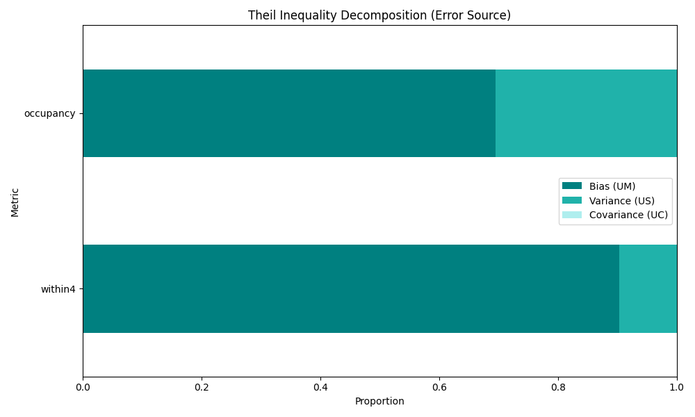

# NHRA Model Technical Validation Report
**Date:** 2025-12-26 18:00:43

## 1. Executive Summary
Model Status: **STABLE**

## 2. Recursive Backtesting Metrics (2011–2024)
| Metric | RMSE | MAPE | Theil U | Hit Rate |
| :--- | :--- | :--- | :--- | :--- |
| within4 | 0.166 | 24.4% | 0.149 | 0.000 |
| occupancy | 0.025 | 2.3% | 0.014 | 0.000 |

## 3. Error Decomposition (Theil)

## 4. Mechanism Integrity (GSA)
Top mechanistic driver (mu_star): **discharge_delay_base**

| Parameter | mu_star | Rank |
| :--- | :--- | :--- |
| discharge_delay_base | 0.0809 | 1 |
| cost_shifting_intensity | 0.0448 | 2 |
| fragmentation_index | 0.0412 | 3 |
| admin_burden_weight | 0.0069 | 4 |
| rurality_weight | 0.0032 | 5 |
| political_salience | 0.0000 | 6 |

## 5. Compliance Notes
- [x] STRESS Guidelines: Model structure and equations documented.
- [x] CHEERS Checklist: Economic parameters sourced from AIHW/ABS.
- [ ] Peer Review: Pending.